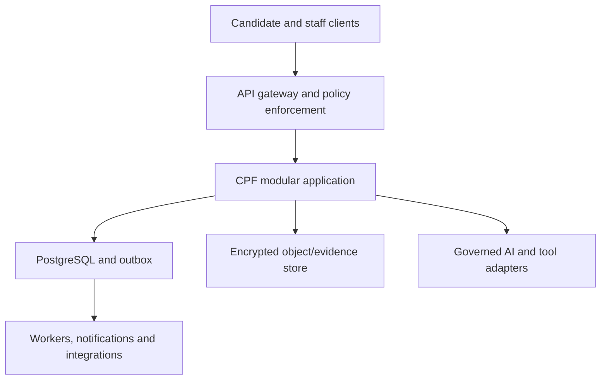

# CPF Developer Handover and Technical Requirements Document

**Version:** 2.0  
**Review date:** 4 August 2026  
**System posture:** High-risk employment AI documentation baseline; implementation and formal readiness evidence outstanding.

## 1. Architecture decision

Build CPF as an EU-hosted, tenant-isolated modular monolith with independently deployable workers and a separately packaged signed desktop companion. Use PostgreSQL 16+ as the transactional system of record, object storage for encrypted artifacts/evidence, an outbox-backed event bus for reliable side effects, and provider/model adapters behind a governed AI gateway. Split services only after measured scaling or isolation needs justify the operational cost.

The architecture must enforce one invariant across web, API, workers, exports and integrations: AI outputs are labelled observations, never numeric candidate scores, ranks, performance bands, integrity verdicts, progression values or hiring decisions.

## 2. Compliance boundary and readiness

CPF's intended evaluation of employment candidates is treated as EU AI Act Annex III 4(a) high-risk. The reviewer role is a required oversight control, not a classification exemption. No environment may be called compliant or production-ready until Legal/DPO/Compliance have approved the real deployment allocation and the applicable release gates have evidence.

Technical documentation shall remain versioned against the exact application build, model/prompt/plugin versions, assessment/rubric versions, datasets, declared thresholds, instructions of use and post-market plan. The currently expected high-risk employment obligations apply on the timeline reflected in the Commission's current 2026 materials; release management must revalidate the effective legal date before launch.

## 3. System context

Trust boundaries:

- Candidate, reviewer, employer and CPF staff contexts use distinct audience tokens and permission policies.
- Tenant identity comes from verified server-side session context, never request-body selection.
- Candidate access is invitation/application/attempt bound; reviewer access is assignment and conflict-policy bound.
- AI/tool vendors receive the minimum purpose-specific data through server adapters; clients do not hold provider secrets.
- Raw/optional proctor media, accommodation data, candidate PII, assessment evidence, telemetry and analytics are separately authorised and retained.
- Platform operations use privileged service identities, target one tenant explicitly and produce purpose-rich audit events.

## 4. Modules and ownership

| Module | Responsibilities | Key invariants |
| --- | --- | --- |
| Identity and account | Invitations, verification, login, MFA/passkeys, reset/change password, profile/name/email, sessions, preferences, security events | No enumeration; step-up; self-service plus controlled recovery |
| Tenant/platform admin | Organisations, staff, roles, plans, flags, releases, jobs, maintenance, vendors | Least privilege; separation of duties; tenant-targeted operations |
| Assessment authoring | Frameworks, assessments, items, rubrics, prompts, models, plugins and versions | Immutable version binding and affected-record analysis |
| Hiring/campaigns | Campaigns, imports, candidates, invitations, bookings, accommodations and applications | Tenant-local identity; preflight gates; no cross-employer matching |
| Runtime | Pre-check, attempt/session state, autosave, flags, breaks, recovery and submission | Authoritative timer; idempotency; offline/recovery integrity |
| Evidence/AI | AI ledger, tool calls, artifacts, integrity events and reviewer AI observations | Provenance; append-only evidence; no AI score/rank/decision |
| Review | Assignments, drafts, human scores, annotations, aggregates, reports and amendments | Human-only score; evidence link; conflict/training checks |
| Decision and remedy | Human decision drafts, second approval, issue, explanation, contest and complaint | No preselected outcome; human authority; versioned reason |
| Governance | Classification, risk, QMS, technical file, data use, impacts, oversight, conformity, monitoring and incidents | Named owners, approvals, expiry, linked evidence |
| Integration/comms | ATS/HRIS, API credentials, webhooks, templates and deliveries | Scope, signature, idempotency, retry bounds and redaction |
| Support/operations | Cases, JIT access, health, jobs, status and incident coordination | No impersonation; purpose-limited access; correlation IDs |
| Audit | Tamper-evident events, manifests and regulator collections | Append-only, retention-aware and export-chain integrity |

## 5. Identity, authorisation and tenant isolation

Use OIDC-compatible identity, short-lived access tokens and server-side hashed refresh-session records. Require verified email for staff, MFA for privileged roles, recent authentication for sensitive self-service, and step-up MFA for privileged/export/decision actions. Password reset tokens and recovery codes are random, hashed, single-use, short-lived and rate-limited. Email change requires dual confirmation.

Authorisation is deny-by-default RBAC plus resource ABAC: platform/tenant/campaign/assignment/candidate-self scope, account status, conflict, training/eligibility, purpose, support-access grant, time and action risk. PostgreSQL RLS is defence in depth for direct tenant tables; service-layer policy remains authoritative for indirect ownership and field projection. Security tests must attempt horizontal/vertical, cross-tenant, stale-token, confused-deputy, IDOR and bulk/export bypasses.

## 6. Human review, scoring and decisions

1. Assignment service checks tenant, campaign, reviewer status, training, calibration, availability, workload, conflict and blind-group constraints.
2. Scorecards autosave with optimistic concurrency. Only `human_score` is accepted; each value requires criterion/version and evidence links or explicit insufficient-evidence state.
3. AI observations reside in `evidence.reviewer_ai_observations`; they include model/prompt/policy provenance, sources, limitations and disposition. The schema has no AI numeric-score field.
4. Deterministic aggregation runs only on eligible submitted human scorecards and a versioned formula; its output is not an AI hiring recommendation.
5. A progression decision starts `draft`, records `decision_origin='human'`, has no default decision value, and is issued only by an authorised employer human. A distinct approver is required by risk policy.
6. Override, reversal, stop, escalation and amendment actions are immutable events with reason and evidence. Candidate remedy never mutates the prior record; it creates a superseding version.

Negative tests shall scan OpenAPI, DTOs, database, feature flags, jobs, analytics, exports and UI copy for AI score/rank/recommendation/automatic integrity/adverse-decision paths.

## 7. Candidate runtime and desktop companion

Model the attempt as an explicit state machine: invited → ready/precheck → active → paused/recovering → submitting → submitted, with terminal expired/voided states. Server time is authoritative. Responses use version/sequence plus idempotency keys. Autosave acknowledgement includes authoritative version and checksum. Submission is single-finalisation and produces an immutable manifest/receipt.

The desktop companion is signed, auto-updated, version-gated, visibly active only during the disclosed session and independently uninstallable. Proctor telemetry is event-first and allow-listed. Optional raw media is a separately approved capability with strict necessity, access and short retention. The client shall not infer emotion, sensitive traits, personality or guilt. Loss of telemetry creates a contextual event and recovery path, not a score or automatic failure.

## 8. AI and plugin gateway

All model and tool calls pass through a server gateway that enforces purpose, model/prompt/plugin version, data minimisation, tool permission, tenant/attempt binding, rate/budget limits, safety policy, timeout/retry, output validation and ledger write. Store request/response hashes, relevant encrypted evidence, model/prompt/policy identifiers, source links, limitations, latency, token/cost metadata and outcome. Never send authentication secrets, accommodation details or unrelated PII.

Model/prompt/plugin activation requires evaluation evidence, declared thresholds, approval, canary/rollback and affected-record analysis. Material changes trigger classification, risk, technical-documentation, DPIA/conformity and deployer-instruction re-evaluation. Provider outage fails to a documented safe state; it must not silently substitute an unapproved model.

## 9. Data model

The SQL baseline contains **138 tables** across: assessment (15), audit (2), evidence (8), governance (35), hiring (15), iam (19), integration (6), review (16), runtime (13), support (2), tenant (7). The field-level data dictionary is normative for purpose, classification, access, lawful-basis note, retention, mutability and encryption.

Data rules:

- UUID keys, UTC timestamps and immutable version references; application-generated UUIDv7 is preferred.
- Separate candidate identity/PII, accommodation/special-category data, assessment content, responses, evidence, monitoring telemetry and analytics.
- Append-only evidence, audit, oversight action, amendment and decision-version records; correction is supersession, never history rewrite.
- Tenant-local deduplication only. No cross-employer identity graph.
- Retention is category/purpose/jurisdiction driven, legal-hold aware and verified by deletion manifests. Backups follow documented expiry.
- Every table with `tenant_id` receives forced RLS; indirect tables require verified parent ownership in repository queries.
- Secrets are hashed or envelope-encrypted with managed keys; object keys are non-guessable and signed URLs are short-lived.

## 10. API contract

The OpenAPI 3.1 baseline contains **244 operations** under `/v2`. Operation distribution: AI Collaboration 3, AI Governance 8, Accommodations 2, Account 14, Assessment Governance 10, Assessment Runtime 12, Audit 5, Authentication 15, Campaigns 12, Candidate Portal 13, Candidates 10, Change Control 2, Communications 5, Conformity 5, Decisions and Reports 6, Employer Admin 14, Governance 23, Incident Governance 2, Integrations 7, Integrity Review 1, Invitations 4, Operations 6, Platform Admin 21, Plugin Governance 3, Post-market Monitoring 4, Reviewer Administration 3, Reviewer Workspace 19, Rights and Complaints 5, Scheduling 3, Support 7. Every operation declares authorised roles, requirement IDs, security audience, correlation response and whether human decision authority is required.

Mutation rules:

- Require `Idempotency-Key` for material create/update/delete commands; store tenant, actor, route, request hash, response and expiry.
- Use optimistic concurrency for drafts and configuration versions. Return RFC 9457-style problems with stable type, status, field errors and correlation ID.
- Validate JSON strictly; reject unknown/security-sensitive fields. Server derives actor, tenant and ownership.
- Exports and background jobs return an async resource with queued/running/partial/failed/cancelled/succeeded status.
- Pagination is cursor based; filter/sort fields are allow-listed. Rate limits vary by identity, tenant, action and abuse risk.
- Webhooks are signed, timestamped, replay-protected, ordered where needed, idempotent and bounded in retry; payloads are minimised.

## 11. Events and audit

Write domain state and `audit.outbox_events` atomically. Workers publish idempotently and track attempts/dead letters. Material events include identity/security changes, role grants, tenant/config/version changes, attempt lifecycle, AI/tool calls, evidence access, reviewer actions, AI-observation dispositions, integrity resolutions, scores, decisions/approvals, rights, exports, support access, releases, incidents, conformity and monitoring.

Audit records contain actor/service, verified tenant, session, action, resource, purpose, outcome, correlation/causation, policy/version references and integrity chain. Never log plaintext secrets, raw candidate answer bodies or unnecessary PII. Auditor collections are read-only, scoped, redacted, expiring and themselves audited.

## 12. Privacy engineering

Maintain a purpose-level data-use register and ROPA with controller/processor role, categories, recipients, legal basis, Art 9 condition where needed, retention, rights, transfer mechanism and owner. Notice acknowledgement proves delivery, not consent or lawful basis. DPIA is a launch gate where required; likely employment evaluation, monitoring and special-category/accommodation scenarios must be assessed with the DPO. Article 22/significant-effect analysis and meaningful human intervention must be deployment specific.

Candidates can access/correct/export/restrict/object/delete where applicable, request explanation/human review, contest integrity findings and complain. Requests verify identity proportionately, route to the responsible controller, track deadlines, explain partial/refused outcomes and respect legal holds. Support and analytics datasets are purpose-separated from assessment scoring and model training.

## 13. Security baseline

Use threat modelling per release; secure SDLC; dependency/SBOM/signature controls; SAST/DAST/secrets/IaC/container scanning; isolated environments; managed keys and rotation; least-privilege service identities; egress allow-lists; encrypted backups; tamper-evident audit; vulnerability disclosure; and rehearsed incident response. A security/privacy breach assessment and an AI Act serious-incident assessment run independently but link evidence.

Security release evidence includes authentication/authorisation tests, cross-tenant isolation, SSRF/file upload, injection, deserialisation, prompt/tool injection, model data leakage, webhook replay, object URL, desktop update/signature, queue duplication, backup restore, logging redaction and independent penetration test remediation.

## 14. Accessibility and usability

Target WCAG 2.2 AA across candidate, reviewer, admin and support critical workflows. Test keyboard-only, screen reader, 200% zoom/large text, reflow, reduced motion, forced colours, contrast, focus order/visibility, time extensions, error recovery and accessible authentication. Assessment items, generated reports, notices and templates need their own accessibility validation. Accommodation details remain segregated from reviewers unless a minimal adjustment instruction is necessary.

## 15. Reliability, performance and operations

Initial engineering targets remain subject to capacity approval: core p95 API ≤400 ms excluding AI, autosave acknowledgement ≤800 ms p95, candidate core flows 99.9% monthly availability, RPO ≤15 minutes and RTO ≤4 hours. AI/tool calls use separate latency budgets and explicit generation/timeout/retry states. Core Web Vitals target LCP ≤2.5 s, INP ≤200 ms and CLS ≤0.1 at p75 for the defined population.

Observability uses structured redacted logs, metrics, traces and correlation IDs. Page immediately on safety/rights, cross-tenant, evidence loss, submission integrity, signing/update and widespread authentication failures. Runbooks name owner, diagnosis, safe state, communication and rollback. Maintenance excludes active candidate windows unless emergency procedure is invoked.

## 16. Verification strategy

The traceability matrix contains **362 requirements**, of which **336 are Must**. A requirement passes only when implementation, automated/manual test result, required approval and residual-risk decision are linked.

| Layer | Minimum evidence |
| --- | --- |
| Unit/property | State transitions, permission predicates, score aggregation, retention calculation, redaction and idempotency |
| Contract/integration | OpenAPI conformance, strict DTOs, AI/tool adapters, ATS/webhooks, object store and identity provider |
| Database | Migration up/down rehearsal, constraints, RLS/parent ownership, concurrency, partitions, deletion/legal hold and restore |
| End-to-end | Each role journey plus loading/empty/error/denied/expired/offline/partial/success states |
| AI evaluation | Intended-purpose quality, subgroup/fairness where lawful, robustness, prompt/tool injection, limitations and stop/rollback |
| Human factors | Reviewer competence, automation bias, evidence interpretation, reject/override/stop and decision separation |
| Accessibility | Automated checks plus manual assistive-technology matrix |
| Security/privacy | Threat model, penetration test, DPIA control verification, purpose lineage, rights and breach/incident drills |
| Operations | Load/soak/chaos, queue replay, backup restore, regional failover, desktop update/rollback and vendor outage |
| Compliance | Classification, QMS, Annex IV technical file, conformity path, declaration/registration/CE and post-market evidence |

## 17. Delivery sequence

1. Identity/tenant foundations, account microfeatures, policy engine, audit/outbox and data segregation.
2. Assessment/campaign authoring, imports/invitations, candidate practice/pre-check/runtime and resilient submission.
3. Reviewer eligibility, evidence workspace, human-only scorecards, aggregation, decision approval and candidate remedy.
4. Governed AI/tool adapters and reviewer observation flow behind disabled-by-default flags.
5. Provider/deployer governance, QMS/technical file, monitoring, incidents, integrations and auditor collections.
6. Independent security/accessibility/human-factors validation, DPIA/legal sign-off, conformity/release gates and controlled pilot.

## 18. Wireframe implementation annotations

Each screen/spec must include actor, entry/exit, required roles, requirement IDs, data classes visible, human authority, AI label/provenance, state matrix, destructive/bulk confirmation, audit event, keyboard/focus behaviour, responsive behaviour and error copy. The reviewer AI-observation panel must be separable/collapsible, must not visually outrank primary evidence, and must offer reject/edit/report/stop. The employer decision form starts empty.

## 19. Official reference set

- [AI Act consolidated text as amended to 27 July 2026](https://eur-lex.europa.eu/legal-content/EN/TXT/HTML/?uri=CELEX:02024R1689-20260727)
- [Regulation (EU) 2026/1744, Digital Omnibus on AI](https://eur-lex.europa.eu/eli/reg/2026/1744/oj/eng)
- [AI Act Annex III](https://ai-act-service-desk.ec.europa.eu/en/ai-act/annex-3)
- [Commission AI Act implementation FAQ](https://digital-strategy.ec.europa.eu/en/faqs/navigating-ai-act)
- [Commission high-risk system guidance and timeline](https://digital-strategy.ec.europa.eu/en/policies/guidelines-ai-high-risk-systems)
- [GDPR](https://eur-lex.europa.eu/eli/reg/2016/679/oj/eng)
- [EDPB automated decision-making and profiling guidance](https://www.edpb.europa.eu/documents/guideline/automated-decision-making-and-profiling_en)
- [Irish Data Protection Commission DPIA guidance](https://www.dataprotection.ie/en/organisations/know-your-obligations/data-protection-impact-assessments)
- [WCAG 2.2](https://www.w3.org/TR/WCAG22/)

---

This TRD is a technical and governance baseline, not legal advice, a conformity assessment or a compliance certificate.
