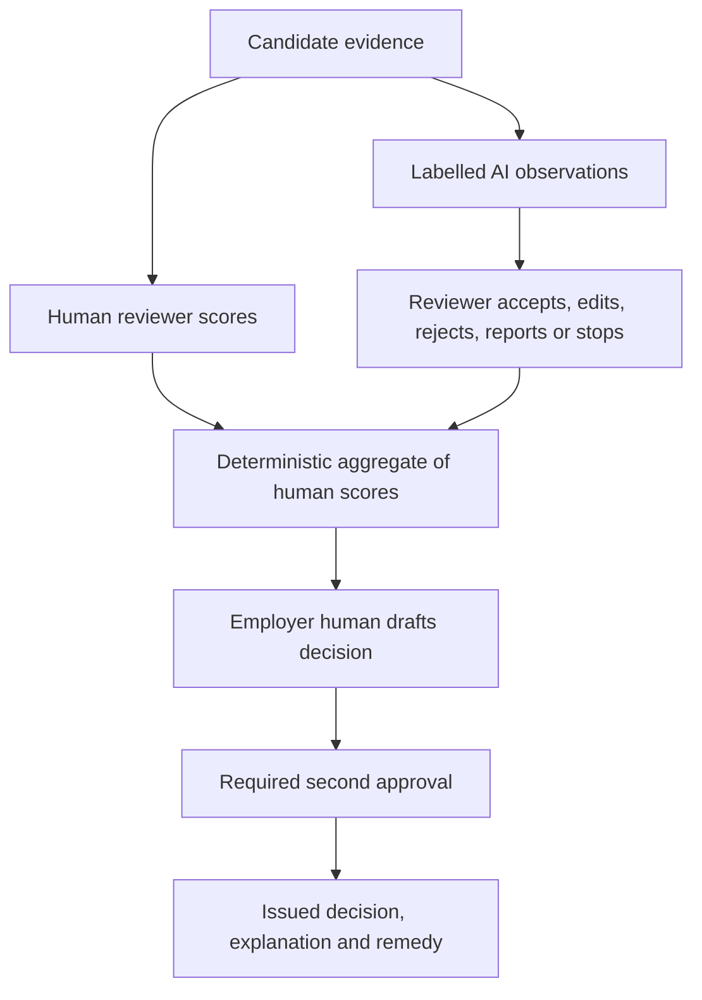

# CPF Product Requirements Pack

**Version:** 2.0  
**Review date:** 4 August 2026  
**Decision:** Documentation baseline ready for wireframing; product compliance and release readiness are **not yet demonstrated**.

## 1. Executive product decision

CPF is an AI-native hiring-assessment platform for employers, reviewers and candidates. Because it evaluates people in an employment context, its intended use falls within EU AI Act Annex III point 4(a) high-risk employment use. Adding a human reviewer does not remove that classification. Human reviewers and employer decision owners are instead part of the mandatory risk-control and human-oversight design.

This pack replaces the v1 product baseline. It preserves the useful assessment, candidate, reviewer and operations scope, adds ordinary software microfeatures for every human role, and turns AI Act, GDPR, security, accessibility and operational duties into implementable business rules. It does not certify the eventual system or promise “100% compliance”. Compliance depends on implementation evidence, current law, the actual provider/deployer allocation, the model and data supply chain, and qualified Legal/DPO/Compliance approvals.

### 1.1 Binding product rule

AI may produce clearly labelled, source-linked observations to help a competent reviewer inspect evidence. AI shall not produce or preselect a candidate numeric score, performance band, rank, cheating verdict, progression recommendation or hiring decision. Human reviewers create all rubric scores. An authorised employer human creates and issues every progression decision; secondary approval applies where policy requires it.

### 1.2 Delivery scale

| Measure | V2 baseline |
| --- | ---: |
| Functional requirements | 295 |
| Non-functional requirements | 67 |
| API operations | 244 |
| Human-role microfeature catalogues | 6 |

## 2. Product outcomes and non-goals

### Outcomes

- Give candidates an accessible, resilient assessment journey with clear AI/monitoring notices, support, accommodations and effective remedy.
- Give reviewers evidence-first tools, competence controls and genuine authority to disregard, override, reverse or stop AI assistance.
- Give employer administrators controlled campaign, reviewer, decision and deployer-readiness workflows.
- Give CPF provider teams the quality, technical-documentation, conformity, post-market and incident evidence needed for a high-risk system.
- Make every material decision reconstructable from versioned inputs, human actions, policies and immutable evidence.

### Non-goals and prohibited product behaviour

- No fully automated hiring or progression decision and no “human rubber stamp”.
- No AI-generated candidate score, rank, band, recommendation or integrity verdict.
- No emotion recognition, personality inference from biometrics, or sensitive-trait inference.
- No covert monitoring, indefinite raw media capture, cross-employer candidate matching or model training from customer/candidate data by default.
- No dark patterns, bundled “consent”, silent staff impersonation or rewriting immutable evidence.
- No compliance badge, CE mark or release claim until the applicable formal gates have passed.

## 3. Actors, authority and separation of duties

| Actor | Authority | Explicit limit |
| --- | --- | --- |
| Candidate | Complete assessment; manage profile, notices, accommodations, incidents and rights | Cannot alter immutable submission evidence |
| Employer Reviewer | Create evidence-linked human rubric scores and resolve contextual signals | Cannot issue the employer progression decision unless separately authorised |
| Employer Admin / Decision Owner | Configure campaigns, assign eligible reviewers, draft/approve/issue decisions | Never receives an AI recommendation or preselected outcome |
| Assessment Designer | Author and version assessments, rubrics and job-relevance evidence | Cannot mutate a version bound to an active attempt |
| CPF Super Admin | Operate tenants, platform configuration, releases and support controls | Cannot silently impersonate users or self-approve incompatible duties |
| Compliance / AI Governance | Classify, control risk, maintain QMS/technical file and post-market evidence | Cannot substitute documentation for tested implementation |
| DPO / Privacy | Advise on controller roles, lawful basis, DPIA, rights and transfers | Independent advice and escalation must remain visible |
| Security / Incident Responder | Contain incidents and preserve evidence | Cannot reuse telemetry for candidate scoring |
| Conformity Approver / Authorised Signatory | Approve conformity evidence and declaration within delegated authority | Must satisfy separation of duties |
| Support / Operations | Resolve cases under time-limited, purpose-scoped access | No standing access to candidate evidence |
| Auditor / Regulator | Purpose-scoped, read-only evidence review | Exports are redacted, logged and time limited |

## 4. Human decision and AI assistance flow

Business rules:

1. The reviewer sees the evidence source, AI-system/version provenance, confidence/limitation statement and generation time for every AI observation.
2. Where validation shows it is usable, the reviewer records an initial independent assessment before AI observations are revealed; changed reasoning is captured to reduce automation bias.
3. A reviewer can reject, edit, report, disregard or stop AI assistance without losing access to the underlying evidence.
4. Integrity/proctor events are contextual signals only. They create no score penalty or misconduct verdict until a trained human considers limitations and alternative explanations.
5. Aggregate calculations use only submitted human rubric scores and an approved deterministic formula. Missing evidence blocks or qualifies aggregation.
6. The employer decision screen has no AI-suggested value. It requires a human reason, evidence links, policy version and, where configured, a distinct second approver.
7. Candidates receive required AI-use information, permitted decision information, an explanation route, human review/contest route, complaint path and controller contact.

## 5. Shared experience contract

Every interactive surface shall design and test: loading, ready, empty, filtered-empty, draft, validation error, permission denied, conflict, expired, offline, queued, partial success, failed, cancelled and complete states as applicable. Valid input survives errors. Long-running operations expose status and a correlation reference. Destructive or high-impact actions show scope and consequences. Lists have accessible search/filter/reset/sort/pagination and do not rely on client-side authorisation.

## 6. Microfeatures by role

### 6.1 All users

| Area | Functions | States | Control |
| --- | --- | --- | --- |
| Access | Accept invitation; verify email; sign in; sign out; sign out all; handle expired/invalid links | Idle, submitting, success, expired, locked, rate-limited, offline | No account enumeration; accessible authentication |
| Password | Forgot password; reset password; change password; password-manager support; breach-safe validation | Requested, delivered, expired, consumed, rejected | Hashed one-time tokens; security event |
| MFA | Enrol; challenge; rename; remove; rotate recovery codes; recover account; passkey where supported | Not enrolled, pending, active, recovery, locked | Step-up for privileged actions; no bypass |
| Profile | Change preferred name; request legal-name correction; change email; timezone; locale; date format | View, edit, validation error, pending verification, complete | PII minimisation; immutable evidence unaffected |
| Preferences | Theme; density; reduced motion; contrast; language; notification channels/categories | Default, customised, inherited, mandatory override | Mandatory security/rights notices cannot be disabled |
| Sessions | View devices; view security activity; revoke one; revoke all; suspicious-login help | Current, recent, revoked, expired, unknown | No IP/device use in candidate evaluation |
| Privacy | View notice history; request export; deactivate; delete; restrict; correct; object; complain | Draft, submitted, verifying, in progress, fulfilled, refused, closed | Controller routing, deadline and legal-hold explanation |
| Support | Create case; choose topic; attach file; message; reopen; rate resolution; view status | Draft, open, awaiting user, escalated, resolved, closed | JIT support access; malware scan |
| Lists | Search; filter; sort; paginate; reset; save view; choose columns; export if authorised | Loading, empty, filtered-empty, partial, error, ready | Server-side permission and tenant boundaries |
| Actions | Preview; confirm; cancel; retry; undo where safe; view job result; download error report | Queued, running, partial, failed, cancelled, complete | Idempotency and audit for material actions |

### 6.2 CPF Super Admin

| Area | Functions | States | Control |
| --- | --- | --- | --- |
| Tenant lifecycle | Create; edit; approve; activate; suspend; reactivate; terminate; owner notes; status history | Draft through terminated | Impact preview; no evidence deletion |
| Staff and roles | Invite; resend; revoke; unlock; deactivate; assign scoped roles; access review | Invited, active, suspended, revoked | Separation of duties; MFA |
| Plans and usage | Version plans; quotas; overrides; expiry; usage alerts; service tier; invoice reference | Draft, active, retired; within/near/over limit | No active-attempt mutation |
| Assessment governance | Create; duplicate; import; version; preview; validate; pilot; approve; schedule; suspend; retire; defect impact | Full controlled lifecycle | Immutable binding; CAPA |
| AI and prompts | Register; evaluate; approve; activate; canary; compare; suspend; roll back; inspect affected records | Draft through retired | High-risk QMS, metrics and logs |
| Plugins and sandboxes | Vendor review; permission scopes; health; quotas; allow-list; suspend; incident; exit | Draft, review, active, degraded, suspended | Least privilege; no client-direct provider calls |
| Proctor controls | Policy versions; desktop releases; minimum version; signal allow-list; media gate; uninstall guidance | Draft, approved, active, suspended | Event-first; no emotion inference |
| Operations | Health; queues; jobs; incidents; feature flags; maintenance; banners; release/rollback | Healthy, degraded, incident, maintenance | Kill switch and runbooks |
| Compliance | Classification; QMS; technical file; DPIA support; conformity; declaration; CE; registration; post-market; serious incident | Draft, review, approved, expired, blocked | Cannot self-assert compliance |
| Audit and vendors | Audit search/export; vendor evidence; subprocessors; contracts; expiry alerts; authority request | Current, due, overdue, superseded | Purpose-scoped evidence and redaction |

### 6.3 Employer Admin

| Area | Functions | States | Control |
| --- | --- | --- | --- |
| Organisation | Edit profile; branding; domains; departments; teams; contacts; timezone; retention | Draft, active, validation error | Tenant scoped; accessibility |
| Members | Invite; resend; revoke; suspend; role scope; access review; SSO status | Invited, active, suspended, revoked | Least privilege |
| Campaigns | Create; autosave; duplicate; preview; preflight; activate; pause; resume; close; archive | Draft through archived | Versioned job relevance and deployer gate |
| Candidates | Add; CSV preview; validate; correct; exclude; commit; dedupe; merge; undo; withdraw | Imported through closed | No cross-employer matching |
| Invitations | Bulk send; resend; extend; expire; revoke; delivery tracking; requirements preview | Created through completed | Notice before proctor install |
| Scheduling | Set windows; timezone; reschedule rules; capacity; alternative arrangements | Available, booked, rescheduled, expired | Accessible alternative route |
| Reviewers | Invite; qualify; train; calibrate; availability; workload; conflict; assign; reassign; adjudicate | Eligible, unavailable, conflicted, assigned | Competent human oversight |
| Decisions | View evidence; compare bands; draft; second approval; issue; correct; explain; communicate | Draft, pending approval, issued, superseded | No AI recommendation or auto-reject |
| Integrations | Connect; test; map; sync; pause; rotate; revoke; webhook; API credential | Draft, active, degraded, revoked | Scoped data and credentials |
| Compliance | Instructions of use; oversight assignee; AI literacy; DPIA status; lawful-basis owner; incidents; rights | Incomplete, ready, overdue, blocked | Employer remains deployer/controller as applicable |

### 6.4 Employer Reviewer

| Area | Functions | States | Control |
| --- | --- | --- | --- |
| Reviewer profile | Expertise; languages; training; calibration; availability; workload; notifications | Eligible, expired, unavailable, suspended | Competence required |
| Assignments | Search; saved queue; accept; decline; conflict; open; pause; submit; reassign | Assigned through completed | Blind and tenant rules |
| Evidence | Open immutable artifact; timeline; bookmark; private/team annotation; source context | Loading, unavailable, quarantined, ready | Evidence before inference |
| Scorecard | Autosave draft; score; evidence link; insufficient evidence; confidence; validate; lock; amend | Draft, conflict, complete, submitted, superseded | Only human numeric score |
| AI observations | View label/provenance; accept as useful; edit; reject; report; stop AI assistance | Pending, useful, edited, rejected, reported | No AI numeric score/rank/decision |
| Integrity | Review event; limitations; alternative explanation; candidate context; resolve; escalate | Unreviewed through resolved | No automatic cheating verdict or score penalty |
| Escalation | Clarification; technical investigation; second review; adjudication; accessibility/support issue | Requested, answered, resolved, closed | Reason, owner and deadline |
| Submission | Completion summary; automation-bias attestation; submit; receipt; amendment request | Blocked, ready, submitting, locked | Human authority and accountability |

### 6.5 Candidate

| Area | Functions | States | Control |
| --- | --- | --- | --- |
| Invitation and profile | Open; verify; recover invalid link; correct contact/name; choose language/timezone | Valid, expired, revoked, used, recovered | Minimum identity data |
| Notices | Read privacy/AI/monitoring/rules; compare versions; acknowledge; download; ask question | Unread, read, acknowledged, changed | Acknowledgement is not default consent |
| Accommodation | Save draft; submit; withdraw; add info; track; receive outcome; escalate | Draft through closed | Sensitive details segregated |
| Schedule and prepare | Book/reschedule; requirements; practice test; system check; rerun; help | Not started, failed, passed, support needed | Failed pre-check does not consume attempt |
| Desktop/proctor | Download; verify signature; install; permission review; update; activate; status; stop; uninstall | Absent, ready, active, disconnected, ended | Visible and inactive outside session |
| Assessment runner | Navigate; flag; answer; upload; replace; autosave; recover; timer; break; submit checklist | Not started through submitted | Keyboard/screen-reader and resilient state |
| AI copilot | Prompt; attach approved file; view limitations; reset if allowed; retry; cite; validate | Ready, generating, blocked, failed, budget reached | Interaction disclosure and full evidence ledger |
| Plugins | Select; inspect scope; run; cancel; retry; view result; report failure | Allowed, running, complete, blocked, failed | Only approved tools and data |
| Incidents | Report; describe; attach; request pause; receive reference; add context; view remedy | Open through resolved | Separate from performance |
| After submission | Receipt; status; withdraw; communications; explanation; human review; contest; DSR; complaint | Submitted through closed | Effective remedy and controller routing |

### 6.6 Supporting roles

| Area | Functions | States | Control |
| --- | --- | --- | --- |
| Assessment Designer | Author; duplicate; preview; validate schema; pilot; calibrate; localise; version; suspend; defect/CAPA | Draft through retired | Job relevance, accessibility and immutable versions |
| Compliance/DPO | Classify; risk; data use; ROPA; DPIA; FRIA support; QMS; conformity; registration; post-market | Draft, review, approved, overdue, blocked | Independent sign-offs and evidence |
| Support/Ops | Case; JIT access; recover session; reattempt; communicate; job retry; status incident; close | Open through closed | Minimum necessary evidence |
| Security | Triage; contain; revoke; preserve; notify-assess; remediate; verify; post-incident review | Open through closed | Separate breach and AI-incident analysis |
| Auditor/Regulator | Scoped read; evidence search; manifest export; trace requirement; finding; follow-up | Granted, active, expired, revoked | Read-only, redacted and logged |

## 7. End-to-end journeys for wireframing

### Candidate

Invitation recovery → minimum profile/correction → versioned privacy, AI and monitoring notices → accommodation/scheduling → practice and technical pre-check → signed desktop/proctor setup where required → resilient assessment runner → governed AI/tools → incident and break handling → submission preview/receipt → status, withdrawal, explanation, human review, data rights and complaint.

### Employer reviewer

Eligibility/training/availability → assignment queue → accept/decline/conflict → immutable evidence workspace → independent scorecard draft → optional labelled AI observations → integrity-context resolution → clarification/escalation → completion/automation-bias attestation → submit/receipt → controlled amendment.

### Employer administrator

Organisation/member setup → deployer instructions and readiness → campaign autosave/preview/preflight → candidate import/dedup/invitations/scheduling → reviewer capacity/assignment → dashboard/export → human decision draft → distinct approval where required → issue/communicate → explanation, contest and complaint handling → archive/retention.

### CPF provider operations and governance

Tenant/staff/plan operations → assessment/model/prompt/plugin governance → feature/release control → support with privileged access → risk/QMS/technical file → privacy/equality impact support → conformity/declaration/registration/CE evidence → post-market monitoring → serious incident and corrective action → audit/regulator evidence.

## 8. Legal and accountability control map

| Control area | Product requirement | Evidence before release |
| --- | --- | --- |
| Classification | Record intended purpose, Annex III 4(a) analysis, provider/deployer roles and prohibited-practice screen per version | Approved classification record and counsel/compliance review |
| Risk management | Identify, estimate, evaluate, control and retest lifecycle risks including foreseeable misuse | Risk register, control tests, residual-risk approvals |
| Data governance | Provenance, relevance, representativeness, quality, bias/limitations and purpose separation | Dataset registry, evaluation reports and approved data-use record |
| Technical documentation | Maintain Annex IV-aligned, versioned and reproducible system documentation | Approved technical file linked to released artifacts |
| Logs and traceability | Record versions, inputs, AI observations, human actions, overrides, incidents and decisions | Retention-tested logs and requirement-to-evidence manifest |
| Human oversight | Competence, training, authority, automation-bias mitigations and stop/override routes | Eligibility/training records plus observed workflow tests |
| Accuracy/robustness/cybersecurity | Declared thresholds, adversarial tests, monitoring and fail-safe behaviour | Independent test evidence and open-risk disposition |
| Provider QMS | Document ownership, design/change control, suppliers, CAPA, complaints, monitoring and record control | Approved QMS procedures and operating evidence |
| Deployer duties | Instructions, relevant inputs, human oversight, monitoring/suspension, logs, workplace/affected-person notice | Tenant readiness gate and employer attestations/evidence |
| GDPR | Controller/processor allocation, lawful basis, transparency, data minimisation, rights, Art 22 analysis, DPIA and transfers | Signed data-use register, DPA/records, DPIA outcome and rights tests |
| Equality/accessibility | Job relevance, accommodations, bias evaluation and WCAG 2.2 AA target | Accessibility report, equality review and remediation evidence |
| Conformity/market access | Applicable internal-control procedure, declaration, registration and CE evidence at the legal trigger | Formal approvals; no self-issued product claim before gate |
| Post-market/incident | Monitor real-world quality, rights, drift, complaints and serious incidents | Approved plan, thresholds, rehearsed reporting workflow and CAPA |

## 9. Release gates

| Gate | Pass condition |
| --- | --- |
| G0 Prohibited practice | Legal/Compliance confirms no prohibited technique or undisclosed material scope |
| G1 Identity and account safety | Account, tenant, least-privilege, MFA, recovery and session tests pass |
| G2 Functional readiness | Must requirements have implementation and acceptance evidence |
| G3 Privacy, rights and proportionality | Controller allocation, lawful basis, DPIA outcome, notices, rights, retention and transfers approved |
| G4 High-risk AI quality and oversight | Data, evaluation, human oversight, robustness and traceability controls pass |
| G5 Deployer readiness | Employer has instructions, competent overseers, input/monitoring/incident processes and required assessments |
| G6 Security and incident readiness | Threat model, pentest, incident/breach/serious-incident drills and remediation complete |
| G7 Formal high-risk compliance | QMS, technical file, conformity route, declaration/registration/CE obligations approved when applicable |
| G8 Operational readiness | SLOs, support, backups, rollback, vendor evidence, desktop compatibility and monitoring pass |
| G9 Non-functional quality | Accessibility, performance, reliability, observability and traceability evidence pass |

## 10. Requirement catalogue

The catalogue is normative. “Specified” means the requirement exists; it does not mean implementation or compliance evidence exists.

| Family | Count | Primary actor / concern |
| --- | --- | --- |
| FR-ACC | 24 | All human users |
| FR-AI | 12 | Candidate; Reviewer; CPF Super Admin |
| FR-AST | 12 | Assessment Designer; CPF Super Admin |
| FR-AUD | 6 | Auditor / Regulator |
| FR-CA | 24 | Candidate |
| FR-CAM | 12 | Employer Admin; Candidate |
| FR-CAN | 12 | Candidate; Support |
| FR-COM | 8 | Employer Admin; Candidate; Integrations |
| FR-DAT | 12 | Candidate; Employer Admin; Compliance |
| FR-EA | 22 | Employer Admin |
| FR-ER | 17 | Employer Reviewer |
| FR-GOV | 32 | Compliance; DPO; CPF Super Admin |
| FR-IAM | 8 | All users / IAM administrators |
| FR-INTG | 12 | Candidate; Integrity Reviewer; Compliance |
| FR-OPS | 10 | CPF Super Admin; Support; Security |
| FR-REP | 10 | Employer Admin; Employer Reviewer |
| FR-REV | 10 | Employer Reviewer; Employer Admin |
| FR-SA | 18 | CPF Super Admin |
| FR-SCR | 10 | Employer Reviewer; Employer Admin |
| FR-SEC | 8 | Security / Incident Responder |
| FR-SUP | 10 | Support and Operations |
| FR-TEN | 6 | CPF Super Admin; Employer Admin |
| NFR-ACC | 5 | Non-functional quality |
| NFR-ACT | 7 | Non-functional quality |
| NFR-AUD | 2 | Non-functional quality |
| NFR-AVL | 3 | Non-functional quality |
| NFR-BCP | 2 | Non-functional quality |
| NFR-CMP | 2 | Non-functional quality |
| NFR-EXP | 2 | Non-functional quality |
| NFR-FAI | 2 | Non-functional quality |
| NFR-INT | 2 | Non-functional quality |
| NFR-MNT | 3 | Non-functional quality |
| NFR-OBS | 3 | Non-functional quality |
| NFR-PER | 5 | Non-functional quality |
| NFR-PRV | 6 | Non-functional quality |
| NFR-QLT | 3 | Non-functional quality |
| NFR-REL | 5 | Non-functional quality |
| NFR-SCL | 3 | Non-functional quality |
| NFR-SEC | 9 | Non-functional quality |
| NFR-USA | 3 | Non-functional quality |
### FR-ACC

| ID | Actor | Requirement | Priority | Verification | Release gate |
| --- | --- | --- | --- | --- | --- |
| FR-ACC-01 | All human users | The system shall support secure invitation acceptance or account activation with email verification, expiry, resend, invalid-link recovery and accessible error states. | Must | Activation, expiry, enumeration and accessibility tests | G1 Identity and account safety |
| FR-ACC-02 | All human users | The system shall support forgot-password and password-reset flows using hashed single-use, short-lived tokens without revealing whether an account exists. | Must | Reset token, enumeration, expiry, replay and notification tests | G1 Identity and account safety |
| FR-ACC-03 | All human users | Authenticated users shall be able to change their password after reauthentication; success shall revoke configurable sessions and issue a security notification. | Must | Reauthentication, revocation and notification tests | G1 Identity and account safety |
| FR-ACC-04 | All human users | Users shall be able to change their preferred/display name; identity-critical legal-name changes shall use a separate correction workflow and remain audited. | Must | Profile update, validation, audit and reviewer-minimisation tests | G1 Identity and account safety |
| FR-ACC-05 | All human users | Users shall be able to request an email-address change with reauthentication, dual-channel confirmation, uniqueness checks, expiry and rollback on failure. | Must | Email takeover and confirmation tests | G1 Identity and account safety |
| FR-ACC-06 | All human users | Privileged users shall enrol and manage approved MFA methods, rotate recovery codes and recover access through a controlled non-bypass flow. | Must | MFA enrolment, challenge, recovery and downgrade tests | G1 Identity and account safety |
| FR-ACC-07 | All human users | The product should support phishing-resistant passkeys for compatible users without removing an accessible recovery route. | Should | Passkey compatibility and recovery tests | G1 Identity and account safety |
| FR-ACC-08 | All human users | Users shall be able to view current and recent sessions/devices and revoke an individual session or all other sessions. | Must | Session list, revocation and stale-token tests | G1 Identity and account safety |
| FR-ACC-09 | All human users | The product shall provide current-session logout and logout-all functions that invalidate server-side refresh credentials. | Must | Logout and replay tests | G1 Identity and account safety |
| FR-ACC-10 | All human users | Authentication shall enforce rate limits, progressive delay, safe lockout, unlock and suspicious-login alerts without using IP/device data for candidate scoring. | Must | Abuse, lockout and score-data-lineage tests | G1 Identity and account safety |
| FR-ACC-11 | All human users | Sensitive actions shall require recent authentication and, for privileged actions, step-up MFA. | Must | Step-up policy matrix tests | G1 Identity and account safety |
| FR-ACC-12 | All human users | Users shall manage locale, timezone, date/time format and interface language independently from immutable evidence timestamps stored in UTC. | Must | Locale, timezone and audit timestamp tests | G1 Identity and account safety |
| FR-ACC-13 | All human users | Users shall manage accessibility preferences including reduced motion, contrast preference, text density and assessment accommodations where applicable. | Must | WCAG preference persistence and assessment boundary tests | G1 Identity and account safety |
| FR-ACC-14 | All human users | Users shall manage notification channels and categories, while mandatory security, rights and assessment-critical notices remain deliverable. | Must | Preference, mandatory-message and unsubscribe tests | G1 Identity and account safety |
| FR-ACC-15 | All human users | Each role shall have a resumable onboarding checklist, contextual help and release-note acknowledgement for material workflow changes. | Should | Onboarding state and version-change tests | G1 Identity and account safety |
| FR-ACC-16 | All human users | Users shall be able to create and track a support case, add messages and attachments, and see service status without granting support broad data access. | Must | Support case, attachment, tenancy and access-grant tests | G1 Identity and account safety |
| FR-ACC-17 | All human users | Users shall be able to view applicable privacy, AI, monitoring and terms notice versions and their acknowledgements. | Must | Notice-history reconstruction test | G1 Identity and account safety |
| FR-ACC-18 | All human users | Users shall be able to view material security activity for their account, including password, MFA, email and session changes. | Must | Security-event visibility and privacy tests | G1 Identity and account safety |
| FR-ACC-19 | All human users | Users shall be able to request an account/data export; the system shall route scope and controller responsibility before producing a protected download. | Must | Export scope, identity, expiry and audit tests | G1 Identity and account safety |
| FR-ACC-20 | All human users | Users shall be able to request account deactivation or deletion; the system shall explain legal holds, controller responsibility and retained records. | Must | Deactivate, legal-hold and deletion-orchestration tests | G1 Identity and account safety |
| FR-ACC-21 | All human users | Forms shall preserve valid input after errors, support password managers and paste, and provide field-level plus summary errors. | Must | Form usability and WCAG error tests | G1 Identity and account safety |
| FR-ACC-22 | All human users | All list pages shall support accessible search, clear filters, reset, sort, pagination, empty states, saved views where justified and export permissions. | Must | List-state, keyboard and authorisation tests | G1 Identity and account safety |
| FR-ACC-23 | All human users | Destructive and high-impact actions shall show scope, consequences and confirmation; bulk actions shall support preview, partial failure and downloadable results. | Must | Bulk/destructive action tests | G1 Identity and account safety |
| FR-ACC-24 | All human users | Every asynchronous action shall expose queued/running/succeeded/failed/cancelled states, correlation reference and safe retry behaviour. | Must | Async state and idempotency tests | G1 Identity and account safety |

### FR-AI

| ID | Actor | Requirement | Priority | Verification | Release gate |
| --- | --- | --- | --- | --- | --- |
| FR-AI-01 | Candidate; Reviewer; CPF Super Admin | The CPF AI copilot shall support contextual chat, task decomposition, document/code/data analysis, draft generation, error explanation, citations where applicable and role-specific tool invocation. | Must | Capability and safety evaluation | G4 High-risk AI quality and oversight |
| FR-AI-02 | Candidate; Reviewer; CPF Super Admin | Each assessment shall configure the available model, system instructions, interaction limits, file/data access, internet state, plugins, execution permissions and logging requirements. | Must | Configuration enforcement tests | G4 High-risk AI quality and oversight |
| FR-AI-03 | Candidate; Reviewer; CPF Super Admin | The AI gateway shall enforce tenant, candidate, attempt and assessment scope for every request. | Must | Scope and data-leak tests | G4 High-risk AI quality and oversight |
| FR-AI-04 | Candidate; Reviewer; CPF Super Admin | The platform shall log candidate prompts, model responses, tool calls, plugin outputs, candidate edits where observable, model ID/version, prompt version, timestamps and relevant policy events. | Must | Audit-log completeness test | G4 High-risk AI quality and oversight |
| FR-AI-05 | Candidate; Reviewer; CPF Super Admin | The candidate interface shall disclose that AI can be wrong, what data it receives and that validation remains the candidate’s responsibility. | Must | Disclosure review | G4 High-risk AI quality and oversight |
| FR-AI-06 | Candidate; Reviewer; CPF Super Admin | Reviewer interfaces shall evaluate effective and responsible AI use rather than prompt volume or stylistic verbosity. | Must | Rubric and UI review | G4 High-risk AI quality and oversight |
| FR-AI-07 | Candidate; Reviewer; CPF Super Admin | AI-generated reviewer observations shall be visually and structurally distinguishable from human scores and comments. | Must | UI and data-model tests | G4 High-risk AI quality and oversight |
| FR-AI-08 | Candidate; Reviewer; CPF Super Admin | Reviewers shall be able to mark labelled AI observations useful, edit them into a human comment, reject them, report them or stop assistance; every disposition and material reasoning change shall be logged. | Must | Override workflow tests | G4 High-risk AI quality and oversight |
| FR-AI-09 | Candidate; Reviewer; CPF Super Admin | The platform shall support prompt-injection controls, output filtering, data-loss prevention and redaction rules appropriate to the assessment. | Must | Security evaluation and adversarial tests | G4 High-risk AI quality and oversight |
| FR-AI-10 | Candidate; Reviewer; CPF Super Admin | The Super Admin shall be able to suspend or roll back an AI model or prompt version and identify affected sessions and reports. | Must | Rollback and impact-analysis tests | G4 High-risk AI quality and oversight |
| FR-AI-11 | Candidate; Reviewer; CPF Super Admin | The plugin framework shall allow only approved, versioned and explicitly permitted tools and shall log scoped calls and outputs. | Must | Allow-list and logging tests | G4 High-risk AI quality and oversight |
| FR-AI-12 | Candidate; Reviewer; CPF Super Admin | A plugin failure shall be recorded as a system incident and shall support recovery or reattempt policy without automatic score penalty. | Must | Failure injection tests | G4 High-risk AI quality and oversight |

### FR-AST

| ID | Actor | Requirement | Priority | Verification | Release gate |
| --- | --- | --- | --- | --- | --- |
| FR-AST-01 | Assessment Designer; CPF Super Admin | The platform shall maintain an assessment catalogue with lifecycle states Draft, Internal Review, Compliance Review, Technical Validation, Pilot, Calibration, Approved, Active, Suspended and Retired. | Must | State-machine tests | G4 High-risk AI quality and oversight |
| FR-AST-02 | Assessment Designer; CPF Super Admin | Only Approved and Active assessment versions shall be assignable to new candidates. | Must | Assignment validation tests | G4 High-risk AI quality and oversight |
| FR-AST-03 | Assessment Designer; CPF Super Admin | Each assessment shall define target role, seniority, competency map, job-relevance rationale, duration, instructions, rubric, evidence examples, AI/plugin permissions and technical requirements. | Must | Completeness validation | G4 High-risk AI quality and oversight |
| FR-AST-04 | Assessment Designer; CPF Super Admin | Each assessment shall record accessibility, security, privacy, bias/fairness and validation reviews. | Must | Governance gate test | G4 High-risk AI quality and oversight |
| FR-AST-05 | Assessment Designer; CPF Super Admin | An attempt shall bind immutably to the assessment, content, rubric, scoring-weight, model, prompt and plugin configuration versions active at launch. | Must | Immutability and reconstruction tests | G4 High-risk AI quality and oversight |
| FR-AST-06 | Assessment Designer; CPF Super Admin | Post-launch defects shall create an impact analysis identifying affected candidates and appropriate remedies. | Must | Defect workflow test | G4 High-risk AI quality and oversight |
| FR-AST-07 | Assessment Designer; CPF Super Admin | A permitted correction or rescore shall create a new report version and preserve the prior version and reason. | Must | Version and audit tests | G4 High-risk AI quality and oversight |
| FR-AST-08 | Assessment Designer; CPF Super Admin | The assessment engine shall support behavioural judgement, domain knowledge, practical work simulation, AI/plugin collaboration and reflection/defence layers. | Must | Content rendering and scoring tests | G4 High-risk AI quality and oversight |
| FR-AST-09 | Assessment Designer; CPF Super Admin | The platform shall support role-specific question and task types including code, documents, spreadsheets, SQL, analytics, campaign simulations and controlled files. | Must | Role-workspace tests | G4 High-risk AI quality and oversight |
| FR-AST-10 | Assessment Designer; CPF Super Admin | Employer customisation shall be limited to CPF-approved parameters and shall block prohibited or unsupported criteria. | Must | Configuration boundary tests | G4 High-risk AI quality and oversight |
| FR-AST-11 | Assessment Designer; CPF Super Admin | Assessment content, rubrics and validation evidence shall have owners, version history, effective dates and revalidation or expiry dates. | Must | Registry inspection | G4 High-risk AI quality and oversight |
| FR-AST-12 | Assessment Designer; CPF Super Admin | The system shall support at least four validated pilot assessments in the MVP. | Must | MVP release gate | G4 High-risk AI quality and oversight |

### FR-AUD

| ID | Actor | Requirement | Priority | Verification | Release gate |
| --- | --- | --- | --- | --- | --- |
| FR-AUD-01 | Auditor / Regulator | Authorised auditors shall receive read-only, purpose-scoped, time-bound access to approved evidence collections. | Must | Auditor access and expiry tests | G7 Formal high-risk AI compliance |
| FR-AUD-02 | Auditor / Regulator | Audit evidence exports shall include manifest, hashes, versions, provenance, redaction log and access history. | Must | Evidence-export reconstruction test | G7 Formal high-risk AI compliance |
| FR-AUD-03 | Auditor / Regulator | Auditors shall be able to trace a requirement to control, implementation, test, result, owner, approval and residual risk. | Must | End-to-end traceability sampling | G7 Formal high-risk AI compliance |
| FR-AUD-04 | Auditor / Regulator | Regulator requests shall be handled through verified authority identity, legal scope, controlled disclosure and chain of custody. | Must | Regulator request exercise | G7 Formal high-risk AI compliance |
| FR-AUD-05 | Auditor / Regulator | Auditor access shall not expose unrelated tenant, candidate, special-category or trade-secret information. | Must | Negative access and redaction tests | G7 Formal high-risk AI compliance |
| FR-AUD-06 | Auditor / Regulator | Audit findings shall create corrective actions without allowing auditors to alter production evidence. | Must | Finding-to-CAPA and read-only tests | G7 Formal high-risk AI compliance |

### FR-CA

| ID | Actor | Requirement | Priority | Verification | Release gate |
| --- | --- | --- | --- | --- | --- |
| FR-CA-01 | Candidate | Candidates shall recover from expired, revoked, already-used or invalid invitation links through a safe employer/support route. | Must | Invitation recovery and enumeration tests | G3 Candidate rights and transparency |
| FR-CA-02 | Candidate | Candidates shall correct profile/contact data through a controller-routed process without changing immutable submitted evidence. | Must | Correction workflow and evidence integrity tests | G3 Candidate rights and transparency |
| FR-CA-03 | Candidate | Candidates shall choose locale, timezone and accessibility preferences before notices and pre-checks. | Must | Preference order and accessible journey tests | G3 Candidate rights and transparency |
| FR-CA-04 | Candidate | Candidate acknowledgements shall record receipt/understanding of notices and shall not be presented as consent where consent is not the legal basis. | Must | Notice wording and lawful-basis tests | G3 Candidate rights and transparency |
| FR-CA-05 | Candidate | Candidates shall draft, submit, withdraw and track accommodation requests and receive a reasoned outcome and escalation route. | Must | Accommodation lifecycle tests | G3 Candidate rights and transparency |
| FR-CA-06 | Candidate | Candidates should schedule or reschedule within approved windows and see all dates in both local timezone and explicit offset. | Should | Scheduling and timezone tests | G3 Candidate rights and transparency |
| FR-CA-07 | Candidate | Candidates shall access a non-scored practice environment for keyboard, autosave, upload, AI and permitted plugin interactions. | Must | Practice isolation and non-scoring tests | G3 Candidate rights and transparency |
| FR-CA-08 | Candidate | Candidates shall rerun failed pre-checks, see remediation steps and request an alternative route without consuming an attempt. | Must | Pre-check retry and attempt-consumption tests | G3 Candidate rights and transparency |
| FR-CA-09 | Candidate | Proctor installation, permissions, update, session activation and uninstall guidance shall be explicit; the app shall remain inactive outside authorised sessions. | Must | Desktop lifecycle and permission tests | G3 Candidate rights and transparency |
| FR-CA-10 | Candidate | The assessment runner shall provide section navigation, item flags, progress, time policy, save status and a submission checklist. | Must | Runner interaction and accessibility tests | G3 Candidate rights and transparency |
| FR-CA-11 | Candidate | Candidates shall use approved breaks or request emergency interruption according to visible policy without silent score penalty. | Must | Break, pause, timer and incident tests | G3 Candidate rights and transparency |
| FR-CA-12 | Candidate | Candidates shall recover encrypted local drafts after interruption and resolve server conflicts without data loss. | Must | Offline/reconnect and conflict tests | G3 Candidate rights and transparency |
| FR-CA-13 | Candidate | Candidates shall reset a conversation context only where assessment policy permits, with the evidence ledger retaining the prior interaction. | Must | AI reset and evidence immutability tests | G3 Candidate rights and transparency |
| FR-CA-14 | Candidate | Candidates shall see AI/provider limitations, current availability, usage budget and retry state without raw vendor errors. | Must | AI status and safe-error tests | G3 Candidate rights and transparency |
| FR-CA-15 | Candidate | Uploads shall show type/size validation, malware scan, progress, cancel, replace and failure recovery. | Must | Upload state and security tests | G3 Candidate rights and transparency |
| FR-CA-16 | Candidate | Plugin actions shall show scope, input preview where relevant, execution state, result and safe retry/cancel behaviour. | Must | Plugin UX and idempotency tests | G3 Candidate rights and transparency |
| FR-CA-17 | Candidate | Candidates shall report technical or integrity context, attach allowed evidence and receive a case reference during the session. | Must | Incident creation and evidence tests | G3 Candidate rights and transparency |
| FR-CA-18 | Candidate | Final submission shall provide a reviewable manifest, irreversible-action confirmation, idempotent result and downloadable receipt. | Must | Submission preview, idempotency and receipt tests | G3 Candidate rights and transparency |
| FR-CA-19 | Candidate | Candidates shall be able to withdraw from the process and receive clear consequences for retained evidence and employer status. | Must | Withdrawal and retention-notice tests | G3 Candidate rights and transparency |
| FR-CA-20 | Candidate | Candidates shall view permitted application status and communications history without seeing confidential reviewer material. | Must | Status visibility and confidentiality tests | G3 Candidate rights and transparency |
| FR-CA-21 | Candidate | Candidates shall request a clear explanation of AI use, principal factors, human review and the issued decision when legally applicable. | Must | Explanation request and content tests | G3 Candidate rights and transparency |
| FR-CA-22 | Candidate | Candidates shall request human review, contest inaccurate data or integrity evidence, express their view and receive a reasoned remedy outcome. | Must | Contestability and human intervention tests | G3 Candidate rights and transparency |
| FR-CA-23 | Candidate | Candidates shall submit GDPR rights requests and complaints, verify identity proportionately and track statutory/controller deadlines. | Must | Rights and complaint workflow tests | G3 Candidate rights and transparency |
| FR-CA-24 | Candidate | Candidates shall access a human support route throughout high-impact steps, including an accessible non-digital alternative where required. | Must | Support availability and accessibility tests | G3 Candidate rights and transparency |

### FR-CAM

| ID | Actor | Requirement | Priority | Verification | Release gate |
| --- | --- | --- | --- | --- | --- |
| FR-CAM-01 | Employer Admin; Candidate | Employer Admins shall be able to create, edit, activate, pause and close role-based hiring campaigns. | Must | Campaign lifecycle acceptance tests | G2 Functional readiness |
| FR-CAM-02 | Employer Admin; Candidate | Each campaign shall record role, seniority, department, owner, job description, competency framework, assessment, review model and decision status. | Must | Schema and UI validation | G2 Functional readiness |
| FR-CAM-03 | Employer Admin; Candidate | The platform shall map or link the job description to an approved competency framework and shall preserve the selected framework version. | Must | Version linkage tests | G2 Functional readiness |
| FR-CAM-04 | Employer Admin; Candidate | Employer Admins shall be able to import candidates manually, by CSV, API or ATS integration as configured. | Must | Import tests for all supported channels | G2 Functional readiness |
| FR-CAM-05 | Employer Admin; Candidate | Candidate imports shall validate fields, return row-level errors and prevent silent overwrite. | Must | Import error and idempotency tests | G2 Functional readiness |
| FR-CAM-06 | Employer Admin; Candidate | The system shall identify likely duplicate candidate records within the same tenant and support merge, separate-application and correction actions. | Must | Duplicate matching tests | G2 Functional readiness |
| FR-CAM-07 | Employer Admin; Candidate | The system shall not match or expose candidate records across employer tenants. | Must | Cross-tenant negative tests | G2 Functional readiness |
| FR-CAM-08 | Employer Admin; Candidate | Employer Admins shall be able to issue unique, expiring and revocable invitations linked to one campaign and candidate. | Must | Invitation security tests | G2 Functional readiness |
| FR-CAM-09 | Employer Admin; Candidate | Invitation communications shall disclose assessment requirements before proctoring installation or permission requests. | Must | Content and journey test | G2 Functional readiness |
| FR-CAM-10 | Employer Admin; Candidate | The system shall support invitation reminders, expiry notices, delivery status, resend and revoke actions. | Must | Notification workflow tests | G2 Functional readiness |
| FR-CAM-11 | Employer Admin; Candidate | Employer Admins shall be able to assign qualified reviewers and configure single, blind double, secondary, adjudication or QA review rules. | Must | Workflow assignment tests | G2 Functional readiness |
| FR-CAM-12 | Employer Admin; Candidate | Campaign dashboards shall expose candidate, invitation, pre-check, attempt, submission, review and decision status with authorised filters. | Must | Dashboard acceptance and permission tests | G2 Functional readiness |

### FR-CAN

| ID | Actor | Requirement | Priority | Verification | Release gate |
| --- | --- | --- | --- | --- | --- |
| FR-CAN-01 | Candidate; Support | The candidate portal shall display role, assessment duration, supported devices, technical requirements, available AI/plugins, monitoring and data-use notices before installation. | Must | Candidate journey acceptance test | G2 Functional readiness |
| FR-CAN-02 | Candidate; Support | Candidates shall be able to acknowledge versioned privacy, monitoring, AI-use and assessment-rule notices. | Must | Notice version and audit test | G2 Functional readiness |
| FR-CAN-03 | Candidate; Support | Candidates shall be able to request and track reasonable accommodations through a restricted workflow. | Must | Accommodation workflow and privacy test | G2 Functional readiness |
| FR-CAN-04 | Candidate; Support | The platform shall provide a technical pre-check that does not consume an attempt. | Must | Pre-check scenario tests | G2 Functional readiness |
| FR-CAN-05 | Candidate; Support | The pre-check shall test only assessment-relevant device, network, application and permission requirements and shall provide remediation guidance. | Must | Device matrix and minimisation review | G2 Functional readiness |
| FR-CAN-06 | Candidate; Support | The controlled workspace shall restrict access to authorised resources, uploads, downloads, clipboard, applications and domains according to the immutable assessment configuration. | Must | Secure-workspace tests | G2 Functional readiness |
| FR-CAN-07 | Candidate; Support | The workspace shall visibly indicate active monitoring and permissions and shall stop monitoring when the authorised session ends. | Must | Session termination and privacy tests | G2 Functional readiness |
| FR-CAN-08 | Candidate; Support | Candidate work shall auto-save within five seconds under normal conditions and support recovery after temporary network loss. | Must | Performance and recovery tests | G2 Functional readiness |
| FR-CAN-09 | Candidate; Support | The candidate shall be able to report a technical incident without leaving the assessment workspace. | Must | Incident-reporting test | G2 Functional readiness |
| FR-CAN-10 | Candidate; Support | System and plugin failures shall create technical incidents and shall not automatically reduce a candidate score. | Must | Failure injection and score-isolation tests | G2 Functional readiness |
| FR-CAN-11 | Candidate; Support | Submission shall validate required artifacts, prevent duplicate finalisation and produce a timestamped confirmation. | Must | Idempotency and confirmation tests | G2 Functional readiness |
| FR-CAN-12 | Candidate; Support | Candidates shall be able to view permitted status, exercise data rights and request human review or challenge inaccurate integrity evidence. | Must | Rights workflow acceptance tests | G2 Functional readiness |

### FR-COM

| ID | Actor | Requirement | Priority | Verification | Release gate |
| --- | --- | --- | --- | --- | --- |
| FR-COM-01 | Employer Admin; Candidate; Integrations | The system shall support versioned templates for invitation, reminder, expiry, installation, pre-check, accommodation, confirmation, incident, reattempt, status and rights communications. | Must | Template and trigger tests | G8 Operational readiness |
| FR-COM-02 | Employer Admin; Candidate; Integrations | Communications shall be tenant-branded only within approved templates and accessibility constraints. | Could | Branding and accessibility tests | G8 Operational readiness |
| FR-COM-03 | Employer Admin; Candidate; Integrations | The platform shall prevent confidential scores or integrity information from being sent to unauthorised recipients. | Must | Recipient and content-rule tests | G8 Operational readiness |
| FR-COM-04 | Employer Admin; Candidate; Integrations | The platform should integrate with ATS, HRIS, identity, email, calendar, video interview, cloud storage, collaboration and BI systems through scoped credentials. | Should | Connector tests | G8 Operational readiness |
| FR-COM-05 | Employer Admin; Candidate; Integrations | Integrations shall support revocation, retry, idempotency, duplicate detection, sync logging and prevention of silent overwrite. | Must | Resilience and data-integrity tests | G8 Operational readiness |
| FR-COM-06 | Employer Admin; Candidate; Integrations | Integration configuration and credentials shall be tenant-specific and access-restricted. | Must | Isolation and secret-management tests | G8 Operational readiness |
| FR-COM-07 | Employer Admin; Candidate; Integrations | The platform should provide versioned APIs and webhooks or polling mechanisms for approved candidate, campaign, status and report-reference operations. | Should | API contract and version tests | G8 Operational readiness |
| FR-COM-08 | Employer Admin; Candidate; Integrations | The system shall document controller and processor responsibilities for each integration data flow. | Must | Data-flow and contract review | G8 Operational readiness |

### FR-DAT

| ID | Actor | Requirement | Priority | Verification | Release gate |
| --- | --- | --- | --- | --- | --- |
| FR-DAT-01 | Candidate; Employer Admin; Compliance | The system shall maintain separate candidate, assessment response, AI interaction, reviewer, proctoring, security, audit, legal-hold and anonymised-research retention categories. | Must | Retention configuration review | G3 Privacy, rights and proportionality |
| FR-DAT-02 | Candidate; Employer Admin; Compliance | Data collection fields and monitoring signals shall record purpose, necessity, access, retention, risk and less-intrusive alternatives. | Must | Data inventory and DPIA review | G3 Privacy, rights and proportionality |
| FR-DAT-03 | Candidate; Employer Admin; Compliance | Accommodation and special-category information shall be segregated and excluded from scoring and reviewer views unless operationally necessary. | Must | Access and data-lineage tests | G3 Privacy, rights and proportionality |
| FR-DAT-04 | Candidate; Employer Admin; Compliance | The platform shall support access, correction, deletion, restriction, objection, portability where applicable, human review, contestation and complaint workflows. | Must | Rights workflow tests | G3 Privacy, rights and proportionality |
| FR-DAT-05 | Candidate; Employer Admin; Compliance | The system shall support configurable retention within legally approved boundaries, deletion execution, backup expiry and legal holds. | Must | Lifecycle and deletion tests | G3 Privacy, rights and proportionality |
| FR-DAT-06 | Candidate; Employer Admin; Compliance | The platform shall support EU/EEA data residency, documented subprocessors, regional backups and transfer mechanisms where required. | Must | Architecture and contract review | G3 Privacy, rights and proportionality |
| FR-DAT-07 | Candidate; Employer Admin; Compliance | Personal data shall be encrypted in transit and at rest and protected by least privilege, key rotation and secrets management. | Must | Security tests and configuration audit | G3 Privacy, rights and proportionality |
| FR-DAT-08 | Candidate; Employer Admin; Compliance | The system shall maintain tamper-evident logs sufficient to reconstruct assessment, model, scoring, submission, review, override, human-score comparison, incident, report, export, privileged-access and deletion events. | Must | Audit reconstruction exercise | G3 Privacy, rights and proportionality |
| FR-DAT-09 | Candidate; Employer Admin; Compliance | Audit and decision evidence shall be accessible through authorised interfaces without direct engineering database access. | Must | Audit portal acceptance test | G3 Privacy, rights and proportionality |
| FR-DAT-10 | Candidate; Employer Admin; Compliance | The platform shall prohibit cross-employer reputation scores, permanent employability scores, shadow profiles and sale of identifiable candidate analytics. | Must | Data-use policy and feature inventory review | G3 Privacy, rights and proportionality |
| FR-DAT-11 | Candidate; Employer Admin; Compliance | The platform shall provide employer DPIA, fundamental-rights assessment and compliance documentation support. | Must | Document-pack acceptance test | G3 Privacy, rights and proportionality |
| FR-DAT-12 | Candidate; Employer Admin; Compliance | Material data, scoring, AI, proctoring, identity, retention or report changes shall enter formal change control. | Must | Release-gate audit | G3 Privacy, rights and proportionality |

### FR-EA

| ID | Actor | Requirement | Priority | Verification | Release gate |
| --- | --- | --- | --- | --- | --- |
| FR-EA-01 | Employer Admin | Employer Admins shall edit organisation profile, approved branding, timezone, domains, controller contacts and candidate-support contacts. | Must | Organisation settings, accessibility and audit tests | G5 Deployer readiness |
| FR-EA-02 | Employer Admin | Employer Admins shall invite, resend, revoke, suspend and role-manage tenant members with department/team scope and access review dates. | Must | Tenant member lifecycle tests | G5 Deployer readiness |
| FR-EA-03 | Employer Admin | Employer Admins shall create, rename, deactivate and restore departments and teams while preserving historical campaign references. | Must | Organisation structure and history tests | G5 Deployer readiness |
| FR-EA-04 | Employer Admin | Employer Admins shall save campaign drafts automatically, duplicate approved configuration, preview the candidate journey and archive closed campaigns. | Must | Draft, duplicate, preview and archive tests | G5 Deployer readiness |
| FR-EA-05 | Employer Admin | Campaign activation shall show a preflight checklist covering assessment version, reviewer capacity, notices, lawful-basis owner, DPIA, retention and support readiness. | Must | Activation gate and missing-control tests | G5 Deployer readiness |
| FR-EA-06 | Employer Admin | Employer Admins shall preview candidate imports, download row-level errors, correct or exclude rows, confirm idempotently and cancel before commit. | Must | Import preview, correction, cancel and idempotency tests | G5 Deployer readiness |
| FR-EA-07 | Employer Admin | Employer Admins shall review tenant-local duplicate candidates, merge with preview and reversal, or keep separate applications with a reason. | Must | Duplicate, merge, undo and cross-tenant tests | G5 Deployer readiness |
| FR-EA-08 | Employer Admin | Employer Admins shall bulk send, resend, extend, expire and revoke invitations with preview, throttling and per-recipient results. | Must | Invitation bulk-operation tests | G5 Deployer readiness |
| FR-EA-09 | Employer Admin | Employer Admins shall configure assessment scheduling windows, candidate timezone display, rescheduling rules and accessibility-aware start arrangements. | Should | Scheduling and timezone tests | G5 Deployer readiness |
| FR-EA-10 | Employer Admin | Employer Admins shall manage reviewer pool expertise, training, calibration, availability, workload and conflict requirements. | Must | Reviewer eligibility and capacity tests | G5 Deployer readiness |
| FR-EA-11 | Employer Admin | Employer Admins shall bulk assign or reassign reviews with conflict, blindness, workload, qualification and continuity checks. | Must | Assignment policy and history tests | G5 Deployer readiness |
| FR-EA-12 | Employer Admin | Employer Admins shall view saved campaign dashboards, search, filters, column preferences and authorised export jobs. | Must | Dashboard state and export tests | G5 Deployer readiness |
| FR-EA-13 | Employer Admin | Employer Admins shall create a draft progression decision, request required secondary approval, issue it, and preserve all versions and evidence. | Must | Decision draft, approval, issue and audit tests | G5 Deployer readiness |
| FR-EA-14 | Employer Admin | Employer Admins shall not receive an AI-generated reject/progress recommendation or preselected decision value. | Must | UI, API and background-job negative tests | G5 Deployer readiness |
| FR-EA-15 | Employer Admin | Employer Admins shall issue candidate communications from approved templates and preview exactly which data will be disclosed. | Must | Communication preview and data-minimisation tests | G5 Deployer readiness |
| FR-EA-16 | Employer Admin | Employer Admins shall configure ATS/HRIS connections, API credentials and webhooks with scope, test, pause, rotate and revoke actions. | Should | Integration lifecycle and secret tests | G5 Deployer readiness |
| FR-EA-17 | Employer Admin | Employer Admins shall view subscription usage, limits and service status without access to platform-wide commercial data. | Should | Entitlement visibility tests | G5 Deployer readiness |
| FR-EA-18 | Employer Admin | Employer Admins shall configure approved retention schedules, view due deletion jobs and apply legal holds only through authorised legal workflow. | Must | Retention, hold-authority and deletion tests | G5 Deployer readiness |
| FR-EA-19 | Employer Admin | Employer Admins shall complete deployer onboarding for instructions of use, human oversight assignment, AI literacy, monitoring and incident reporting before launch. | Must | Deployer readiness gate test | G5 Deployer readiness |
| FR-EA-20 | Employer Admin | Employer Admins shall record the lawful basis owner and DPIA status per processing purpose; the UI shall not default recruitment monitoring to consent. | Must | Lawful-basis configuration and consent anti-pattern tests | G5 Deployer readiness |
| FR-EA-21 | Employer Admin | Employer Admins shall provide affected candidates the required high-risk AI use notice before AI-assisted evaluation. | Must | Affected-person notice timing and version tests | G5 Deployer readiness |
| FR-EA-22 | Employer Admin | Employer Admins shall route accommodation decisions to restricted authorised staff and expose only operational adjustments to reviewers. | Must | Accommodation segregation tests | G5 Deployer readiness |

### FR-ER

| ID | Actor | Requirement | Priority | Verification | Release gate |
| --- | --- | --- | --- | --- | --- |
| FR-ER-01 | Employer Reviewer | Reviewers shall maintain expertise, language, training, calibration, availability and workload profiles visible to authorised assigners. | Must | Profile and assignment-eligibility tests | G4 Meaningful human oversight |
| FR-ER-02 | Employer Reviewer | Reviewers shall accept or decline assignments and provide a structured decline reason without exposing it to candidates unless required. | Must | Assignment response and confidentiality tests | G4 Meaningful human oversight |
| FR-ER-03 | Employer Reviewer | Reviewers shall declare, update and resolve conflicts before accessing candidate evidence. | Must | Conflict gate and access tests | G4 Meaningful human oversight |
| FR-ER-04 | Employer Reviewer | Reviewers shall search, filter, sort and save queue views while blind-review rules suppress prohibited information. | Must | Queue and blindness tests | G4 Meaningful human oversight |
| FR-ER-05 | Employer Reviewer | Reviewers shall bookmark and annotate evidence with private/team scopes and immutable evidence references. | Must | Annotation scope and evidence-version tests | G4 Meaningful human oversight |
| FR-ER-06 | Employer Reviewer | Review scorecards shall autosave drafts, expose save/conflict state and recover without changing the immutable submission. | Must | Draft recovery and concurrency tests | G4 Meaningful human oversight |
| FR-ER-07 | Employer Reviewer | Reviewers shall use criterion completion checks, evidence minimums, insufficient-evidence states and confidence distinct from performance. | Must | Scorecard validation tests | G4 Meaningful human oversight |
| FR-ER-08 | Employer Reviewer | AI assistance may provide labelled evidence observations but shall not populate, suggest or predict numeric scores, ranking or progression outcomes. | Must | Schema, API, UI and model-output negative tests | G4 Meaningful human oversight |
| FR-ER-09 | Employer Reviewer | Reviewers shall accept as useful, edit, reject or report each AI observation; disposition shall not replace their own rationale. | Must | AI observation disposition and audit tests | G4 Meaningful human oversight |
| FR-ER-10 | Employer Reviewer | Reviewers shall resolve integrity events only with approved non-accusatory statuses, evidence, limitations and alternative explanations. | Must | Integrity resolution and language tests | G4 Meaningful human oversight |
| FR-ER-11 | Employer Reviewer | Reviewers shall request candidate clarification, technical investigation, secondary review or adjudication through controlled workflows. | Must | Escalation workflow tests | G4 Meaningful human oversight |
| FR-ER-12 | Employer Reviewer | Reviewers shall submit and lock a complete scorecard; later correction shall require a reasoned amendment version, not silent editing. | Must | Submission lock and amendment tests | G4 Meaningful human oversight |
| FR-ER-13 | Employer Reviewer | Reviewers shall be warned of automation bias and must attest that they reviewed source evidence before submission. | Must | Oversight attestation and usability test | G4 Meaningful human oversight |
| FR-ER-14 | Employer Reviewer | Reviewers shall be able to disregard AI, stop AI assistance for the case and report a harmful or anomalous output. | Must | Override, stop and incident tests | G4 Meaningful human oversight |
| FR-ER-15 | Employer Reviewer | Reviewers shall see the assessment intended purpose, limitations, accuracy statement and applicable human-oversight instructions. | Must | Instructions-of-use presentation test | G4 Meaningful human oversight |
| FR-ER-16 | Employer Reviewer | Reviewer notifications shall cover assignments, due dates, clarifications and adjudication without candidate data in insecure channels. | Must | Notification content and preference tests | G4 Meaningful human oversight |
| FR-ER-17 | Employer Reviewer | Reviewers shall access support and report accessibility or technical barriers without exposing unnecessary candidate evidence. | Must | Support and minimisation tests | G4 Meaningful human oversight |

### FR-GOV

| ID | Actor | Requirement | Priority | Verification | Release gate |
| --- | --- | --- | --- | --- | --- |
| FR-GOV-01 | Compliance, DPO, CPF Super Admin | The platform shall maintain a versioned intended-purpose and foreseeable-misuse statement for each CPF AI system and material configuration. | Must | Intended-purpose completeness and version tests | G7 Formal high-risk AI compliance |
| FR-GOV-02 | Compliance, DPO, CPF Super Admin | CPF shall maintain a signed AI Act classification record treating candidate evaluation as Annex III 4(a) high-risk unless qualified legal review documents a different scoped use. | Must | Classification record and legal-signoff gate | G7 Formal high-risk AI compliance |
| FR-GOV-03 | Compliance, DPO, CPF Super Admin | Every release shall run and retain an Article 5 prohibited-practices assessment, including workplace emotion inference and sensitive biometric categorisation. | Must | Prohibited-practice control and negative capability tests | G7 Formal high-risk AI compliance |
| FR-GOV-04 | Compliance, DPO, CPF Super Admin | A continuous lifecycle risk-management system shall identify, analyse, evaluate, mitigate, test and monitor reasonably foreseeable risks and misuse. | Must | AI risk register and risk-control effectiveness review | G7 Formal high-risk AI compliance |
| FR-GOV-05 | Compliance, DPO, CPF Super Admin | Training, validation and test data used by CPF shall have provenance, purpose, representativeness, quality, bias, gap and governance records. | Must | Dataset registry and lineage tests | G7 Formal high-risk AI compliance |
| FR-GOV-06 | Compliance, DPO, CPF Super Admin | Technical documentation shall be versioned before release, kept current and cover Annex IV content and requirement-to-evidence traceability. | Must | Technical-document completeness gate | G7 Formal high-risk AI compliance |
| FR-GOV-07 | Compliance, DPO, CPF Super Admin | The AI system shall automatically generate protected logs sufficient for traceability, monitoring and incident investigation without storing hidden reasoning. | Must | Log completeness, integrity and minimisation tests | G7 Formal high-risk AI compliance |
| FR-GOV-08 | Compliance, DPO, CPF Super Admin | CPF shall publish deployer instructions covering intended purpose, limitations, accuracy metrics, input requirements, oversight, monitoring, maintenance and incidents. | Must | Instructions-of-use acceptance review | G7 Formal high-risk AI compliance |
| FR-GOV-09 | Compliance, DPO, CPF Super Admin | Human-oversight controls shall enable competent reviewers to understand, monitor, interpret, disregard, override, reverse, stop and escalate AI use. | Must | Observed oversight usability and authority test | G7 Formal high-risk AI compliance |
| FR-GOV-10 | Compliance, DPO, CPF Super Admin | CPF shall declare task-specific accuracy, robustness and cybersecurity metrics and thresholds by model/system version and affected use case. | Must | Metric declaration and evaluation evidence test | G7 Formal high-risk AI compliance |
| FR-GOV-11 | Compliance, DPO, CPF Super Admin | CPF shall operate a documented quality management system covering strategy, design, testing, data, risk, changes, incidents, suppliers, records and accountability. | Must | QMS internal audit | G7 Formal high-risk AI compliance |
| FR-GOV-12 | Compliance, DPO, CPF Super Admin | Provider documentation, logs and conformity evidence shall be retained for the legally required period and protected against unauthorised change. | Must | Retention and integrity test | G7 Formal high-risk AI compliance |
| FR-GOV-13 | Compliance, DPO, CPF Super Admin | Each Annex III release shall complete the applicable internal-control conformity assessment before market placement or service use. | Must | Conformity checklist and approval gate | G7 Formal high-risk AI compliance |
| FR-GOV-14 | Compliance, DPO, CPF Super Admin | CPF shall generate and retain an EU declaration of conformity only after the conformity decision is approved. | Must | Declaration generation and approval tests | G7 Formal high-risk AI compliance |
| FR-GOV-15 | Compliance, DPO, CPF Super Admin | CPF shall manage CE-marking evidence and prevent display of a conformity mark before the required assessment and declaration are complete. | Must | CE gating and marketing negative tests | G7 Formal high-risk AI compliance |
| FR-GOV-16 | Compliance, DPO, CPF Super Admin | CPF shall maintain EU database registration data and evidence for each in-scope high-risk system before required market placement. | Must | Registration completeness and release gate | G7 Formal high-risk AI compliance |
| FR-GOV-17 | Compliance, DPO, CPF Super Admin | CPF shall operate a versioned post-market monitoring plan using real-world quality, override, complaint, subgroup, incident and drift signals. | Must | Post-market plan and signal-ingestion tests | G7 Formal high-risk AI compliance |
| FR-GOV-18 | Compliance, DPO, CPF Super Admin | Serious incidents shall be triaged, preserved, reported and communicated within applicable deadlines with provider/deployer responsibilities recorded. | Must | Serious-incident simulation and timeline test | G7 Formal high-risk AI compliance |
| FR-GOV-19 | Compliance, DPO, CPF Super Admin | Risk, non-conformity and defect findings shall trigger containment, suspension, corrective action, effectiveness verification and authority/customer notification as applicable. | Must | Corrective-action and suspension exercise | G7 Formal high-risk AI compliance |
| FR-GOV-20 | Compliance, DPO, CPF Super Admin | CPF shall support competent-authority requests through a controlled evidence export, legal review and immutable access log. | Must | Authority cooperation exercise | G7 Formal high-risk AI compliance |
| FR-GOV-21 | Compliance, DPO, CPF Super Admin | Material changes shall be classified for substantial-modification risk and require re-evaluation, documentation, conformity and registration updates as applicable. | Must | Change-control and materiality tests | G7 Formal high-risk AI compliance |
| FR-GOV-22 | Compliance, DPO, CPF Super Admin | CPF shall maintain vendor/model evidence covering role, data terms, retention, training use, subprocessors, security, limitations, changes, incidents and exit. | Must | Vendor due-diligence gate | G7 Formal high-risk AI compliance |
| FR-GOV-23 | Compliance, DPO, CPF Super Admin | CPF and each deployer shall record role-based AI literacy training, competence assessment, expiry and remediation for staff dealing with the system. | Must | AI literacy coverage and expiry tests | G7 Formal high-risk AI compliance |
| FR-GOV-24 | Compliance, DPO, CPF Super Admin | Article 50 interaction disclosures shall be shown before or at first AI interaction and remain accessible and versioned. | Must | AI disclosure timing and accessibility tests | G7 Formal high-risk AI compliance |
| FR-GOV-25 | Compliance, DPO, CPF Super Admin | CPF shall maintain a purpose-level Data Use Register, ROPA linkage, lawful-basis owner, retention, transfers and rights mapping. | Must | Data-use register completeness test | G7 Formal high-risk AI compliance |
| FR-GOV-26 | Compliance, DPO, CPF Super Admin | DPIA status shall gate pilot/production where processing is likely high risk; unresolved high residual risk shall block release or trigger prior consultation. | Must | DPIA gate and residual-risk tests | G7 Formal high-risk AI compliance |
| FR-GOV-27 | Compliance, DPO, CPF Super Admin | The platform shall support, but not automatically claim, a deployer FRIA where required or voluntarily performed, keeping it distinct from the DPIA. | Must | FRIA/DPIA separation test | G7 Formal high-risk AI compliance |
| FR-GOV-28 | Compliance, DPO, CPF Super Admin | Bias and equality evaluations shall define affected groups, lawful data access, metrics, error costs, intersectional analysis, thresholds and remediation. | Must | Fairness evaluation protocol review | G7 Formal high-risk AI compliance |
| FR-GOV-29 | Compliance, DPO, CPF Super Admin | Protected-characteristic data used for lawful bias monitoring shall be segregated, pseudonymised, access-restricted, short-retained and excluded from individual decisions. | Must | Fairness data isolation and deletion tests | G7 Formal high-risk AI compliance |
| FR-GOV-30 | Compliance, DPO, CPF Super Admin | CPF shall provide the deployer evidence needed to inform affected persons and to answer explanation, complaint and rights requests. | Must | Deployer evidence pack and explanation drill | G7 Formal high-risk AI compliance |
| FR-GOV-31 | Compliance, DPO, CPF Super Admin | Governance approvals shall enforce separation of duties among author, evaluator, approver, release operator and auditor for material controls. | Must | Approval-matrix and self-approval negative tests | G7 Formal high-risk AI compliance |
| FR-GOV-32 | Compliance, DPO, CPF Super Admin | Compliance and marketing content shall prohibit absolute claims such as unbiased, guaranteed, 100% compliant or cheating-proof without authorised evidence. | Must | Content lint and approval test | G7 Formal high-risk AI compliance |

### FR-IAM

| ID | Actor | Requirement | Priority | Verification | Release gate |
| --- | --- | --- | --- | --- | --- |
| FR-IAM-01 | All users / IAM administrators | The system shall provide separate permission sets for CPF Super Admin, Employer Admin, Employer Reviewer, Candidate and approved supporting roles. | Must | Role-permission tests and negative-access tests | G1 Identity, tenant and access safety |
| FR-IAM-02 | All users / IAM administrators | The system shall enforce tenant-aware role-based access control on every API, user interface and data query. | Must | Automated authorisation and cross-tenant penetration tests | G1 Identity, tenant and access safety |
| FR-IAM-03 | All users / IAM administrators | Privileged users shall use multi-factor authentication; enterprise tenants should support SSO and automated provisioning. | Must | MFA policy tests; SAML/OIDC integration tests | G1 Identity, tenant and access safety |
| FR-IAM-04 | All users / IAM administrators | The system shall support secure session expiry, revocation, concurrent-session policy and risk-based reauthentication. | Must | Security test suite | G1 Identity, tenant and access safety |
| FR-IAM-05 | All users / IAM administrators | Super Admin access to candidate content shall require a justified support, security, compliance or legal purpose and shall be logged. | Must | Privileged-access workflow test and audit review | G1 Identity, tenant and access safety |
| FR-IAM-06 | All users / IAM administrators | Candidates shall authenticate through a valid invitation and approved identity-verification method configured for the assessment. | Must | Invitation and identity scenario tests | G1 Identity, tenant and access safety |
| FR-IAM-07 | All users / IAM administrators | The system shall revoke access promptly when a user is removed, a reviewer is reassigned or an organisation is suspended. | Must | Lifecycle and revocation tests | G1 Identity, tenant and access safety |
| FR-IAM-08 | All users / IAM administrators | The system shall record successful and failed authentication, authorisation denials and privileged access events. | Must | Audit-log inspection | G1 Identity, tenant and access safety |

### FR-INTG

| ID | Actor | Requirement | Priority | Verification | Release gate |
| --- | --- | --- | --- | --- | --- |
| FR-INTG-01 | Candidate; Integrity Reviewer; Compliance | The proctoring solution shall use event-based monitoring wherever possible and collect only configured, necessary signals. | Must | Privacy design review and telemetry tests | G3 Privacy, rights and proportionality |
| FR-INTG-02 | Candidate; Integrity Reviewer; Compliance | Permitted event types may include focus loss, unapproved application, restricted paste, monitor change, permission removal, launcher stop, network loss, identity failure and environment modification. | Must | Event simulation tests | G3 Privacy, rights and proportionality |
| FR-INTG-03 | Candidate; Integrity Reviewer; Compliance | The system shall not interpret looking away, movement, nervousness, pauses or soft speech as cheating evidence. | Must | Rule-set review and negative tests | G3 Privacy, rights and proportionality |
| FR-INTG-04 | Candidate; Integrity Reviewer; Compliance | Camera or microphone collection shall begin only after clear notice and permission, remain visibly indicated, and stop at assessment end. | Must | Permission and termination tests | G3 Privacy, rights and proportionality |
| FR-INTG-05 | Candidate; Integrity Reviewer; Compliance | The platform shall not infer emotion, personality, honesty, confidence, mental state or employability from facial, vocal or behavioural signals. | Must | Model inventory and prohibited-capability tests | G3 Privacy, rights and proportionality |
| FR-INTG-06 | Candidate; Integrity Reviewer; Compliance | Interaction telemetry shall be restricted to the controlled workspace and shall not capture passwords, private communications or unrelated activity. | Must | Telemetry boundary tests | G3 Privacy, rights and proportionality |
| FR-INTG-07 | Candidate; Integrity Reviewer; Compliance | Each integrity event shall contain event type, timestamp, source, evidence, confidence, limitations, alternative explanations, candidate incident context, reviewer conclusion and resolution status. | Must | Schema and UI acceptance tests | G3 Privacy, rights and proportionality |
| FR-INTG-08 | Candidate; Integrity Reviewer; Compliance | The platform shall not display or store an automatically generated conclusion that a candidate cheated. | Must | Content and decision-rule tests | G3 Privacy, rights and proportionality |
| FR-INTG-09 | Candidate; Integrity Reviewer; Compliance | Integrity indicators shall remain separate from competency scores and shall not automatically reduce technical or professional scores. | Must | Scoring isolation tests | G3 Privacy, rights and proportionality |
| FR-INTG-10 | Candidate; Integrity Reviewer; Compliance | Material integrity actions shall require an authorised human and may include clarification, live verification, reattempt, second review or documented invalidation. | Must | Human-approval workflow tests | G3 Privacy, rights and proportionality |
| FR-INTG-11 | Candidate; Integrity Reviewer; Compliance | Raw video or audio shall use restricted access and the shortest approved retention; relevant segments shall be exposed only to authorised integrity reviewers. | Must | Access and retention tests | G3 Privacy, rights and proportionality |
| FR-INTG-12 | Candidate; Integrity Reviewer; Compliance | The candidate application shall be digitally signed, securely updateable, removable, transparent about permissions and inactive outside authorised sessions. | Must | Code-signing, update and process-lifecycle tests | G3 Privacy, rights and proportionality |

### FR-OPS

| ID | Actor | Requirement | Priority | Verification | Release gate |
| --- | --- | --- | --- | --- | --- |
| FR-OPS-01 | CPF Super Admin; Support; Security | The Super Admin dashboard shall show employer, subscription, usage, active session, support, system, security, model, plugin, assessment, fairness, retention and corrective-action status. | Must | Dashboard acceptance test | G8 Operational readiness |
| FR-OPS-02 | CPF Super Admin; Support; Security | Authorised Super Admins shall be able to suspend an assessment, model, plugin, proctoring rule, integration, tenant or candidate session. | Must | Suspension workflow tests | G8 Operational readiness |
| FR-OPS-03 | CPF Super Admin; Support; Security | The platform shall support incident ownership, severity, evidence, containment, recovery, communication, corrective action and closure records. | Must | Incident lifecycle test | G8 Operational readiness |
| FR-OPS-04 | CPF Super Admin; Support; Security | The system shall monitor assessment and model performance, plugin reliability, proctoring false positives, reviewer calibration and fairness indicators. | Must | Monitoring coverage test | G8 Operational readiness |
| FR-OPS-05 | CPF Super Admin; Support; Security | Assessment or model threshold breaches shall create alerts and review or suspension tasks. | Must | Alert and workflow test | G8 Operational readiness |
| FR-OPS-06 | CPF Super Admin; Support; Security | The platform shall support backup, recovery, business continuity and disaster recovery procedures. | Must | Recovery exercise | G8 Operational readiness |
| FR-OPS-07 | CPF Super Admin; Support; Security | The platform shall support configurable feature flags and controlled migrations without silently altering active assessment behaviour. | Must | Release and migration tests | G8 Operational readiness |
| FR-OPS-08 | CPF Super Admin; Support; Security | Operational analytics shall use appropriately governed aggregate data and shall not expose cross-employer candidate identities. | Must | Analytics privacy test | G8 Operational readiness |
| FR-OPS-09 | CPF Super Admin; Support; Security | The platform shall maintain assessment-validation, model-governance, risk, control, incident and compliance evidence registers. | Must | Evidence-register review | G8 Operational readiness |
| FR-OPS-10 | CPF Super Admin; Support; Security | The platform shall support future learning-management integration without using identifiable hiring data for unrelated purposes. | Could | Architecture and privacy review | G8 Operational readiness |

### FR-REP

| ID | Actor | Requirement | Priority | Verification | Release gate |
| --- | --- | --- | --- | --- | --- |
| FR-REP-01 | Employer Admin; Employer Reviewer | Candidate reports shall include candidate/assessment identifiers, versions, completion date, duration, reviewer status and report version. | Must | Report content tests | G4 High-risk AI quality and oversight |
| FR-REP-02 | Employer Admin; Employer Reviewer | Reports shall provide an executive summary with performance band, strengths, areas for validation, evidence confidence, material incidents and human-review status. | Must | Report content tests | G4 High-risk AI quality and oversight |
| FR-REP-03 | Employer Admin; Employer Reviewer | Each competency section shall show score, weight, evidence, reviewer comment, confidence, AI observation label and human approval status. | Must | Traceability test | G4 High-risk AI quality and oversight |
| FR-REP-04 | Employer Admin; Employer Reviewer | AI collaboration reporting may cover decomposition, prompting, tool selection, validation, correction, unsupported reliance, efficiency and final human judgement. | Must | Rubric/report review | G4 High-risk AI quality and oversight |
| FR-REP-05 | Employer Admin; Employer Reviewer | Reports shall not use unsupported labels about dishonesty, emotion, trustworthiness, personality or cultural suitability. | Must | Content-policy tests | G4 High-risk AI quality and oversight |
| FR-REP-06 | Employer Admin; Employer Reviewer | Integrity sections shall show event counts, categories, resolution state, material concerns, human determination and candidate explanation where applicable. | Must | Report content tests | G4 High-risk AI quality and oversight |
| FR-REP-07 | Employer Admin; Employer Reviewer | Reports shall generate targeted interview questions based on strengths, weaknesses, uncertainty, ownership, AI validation and trade-offs. | Must | Question-generation evaluation | G4 High-risk AI quality and oversight |
| FR-REP-08 | Employer Admin; Employer Reviewer | Every report shall state that it is one input, human review is required, scores have limitations and lawful job-relevant criteria must govern decisions. | Must | Decision-support notice test | G4 High-risk AI quality and oversight |
| FR-REP-09 | Employer Admin; Employer Reviewer | Employer dashboards shall show campaign, pipeline, completion, review, score, confidence, incident, decision, retention and subscription information without sensitive proxy filters. | Must | Dashboard acceptance tests | G4 High-risk AI quality and oversight |
| FR-REP-10 | Employer Admin; Employer Reviewer | Report export shall be permissioned, versioned and audited. | Should | Export security tests | G4 High-risk AI quality and oversight |

### FR-REV

| ID | Actor | Requirement | Priority | Verification | Release gate |
| --- | --- | --- | --- | --- | --- |
| FR-REV-01 | Employer Reviewer; Employer Admin | Submitted attempts shall enter a review queue and be assigned only to approved reviewers. | Must | Queue and assignment tests | G2 Functional readiness |
| FR-REV-02 | Employer Reviewer; Employer Admin | Reviewers shall see the approved role context, rubric, criterion anchors, required evidence and immutable versions. | Must | Reviewer workspace test | G2 Functional readiness |
| FR-REV-03 | Employer Reviewer; Employer Admin | Reviewers shall be able to inspect candidate artifacts, relevant AI/plugin activity and integrity or technical events. | Must | Evidence viewer tests | G2 Functional readiness |
| FR-REV-04 | Employer Reviewer; Employer Admin | Reviewers shall score only approved criteria and provide evidence-linked comments, confidence and insufficient-evidence states. | Must | Scorecard validation tests | G2 Functional readiness |
| FR-REV-05 | Employer Reviewer; Employer Admin | The system shall support single, blind double, secondary, adjudication and random QA review workflows. | Should | Workflow matrix tests | G2 Functional readiness |
| FR-REV-06 | Employer Reviewer; Employer Admin | Blind review shall hide another reviewer’s score until the independent review is submitted. | Should | Blindness test | G2 Functional readiness |
| FR-REV-07 | Employer Reviewer; Employer Admin | Reviewer disagreement beyond a configured threshold shall trigger adjudication or secondary review. | Should | Threshold workflow test | G2 Functional readiness |
| FR-REV-08 | Employer Reviewer; Employer Admin | Reviewer qualification shall include expertise, role assignment, training, calibration status, conflict declaration and volume limits where configured. | Should | Eligibility and assignment tests | G2 Functional readiness |
| FR-REV-09 | Employer Reviewer; Employer Admin | Reviewer calibration shall support benchmark submissions, scoring exercises, agreement analysis, feedback and periodic recertification. | Should | Calibration acceptance tests | G2 Functional readiness |
| FR-REV-10 | Employer Reviewer; Employer Admin | Review submission shall be blocked until required criteria, evidence and conclusions are complete. | Must | Validation tests | G2 Functional readiness |

### FR-SA

| ID | Actor | Requirement | Priority | Verification | Release gate |
| --- | --- | --- | --- | --- | --- |
| FR-SA-01 | CPF Super Admin | Super Admins shall invite, resend, revoke, suspend, unlock and deactivate CPF staff accounts and assign least-privilege platform roles with expiry. | Must | Staff lifecycle and privilege-escalation tests | G8 Operational readiness |
| FR-SA-02 | CPF Super Admin | Super Admins shall search, filter, create, edit, approve, suspend, reactivate and terminate tenants with dependency and affected-session previews. | Must | Tenant lifecycle and impact-preview tests | G8 Operational readiness |
| FR-SA-03 | CPF Super Admin | Super Admins shall manage plan versions, entitlements, quotas, exception expiry and usage alerts without changing active assessment evidence. | Should | Entitlement version and active-session tests | G8 Operational readiness |
| FR-SA-04 | CPF Super Admin | Super Admins shall maintain internal tenant notes, owners, commercial references and renewal dates outside candidate evidence views. | Should | Tenant metadata and access tests | G8 Operational readiness |
| FR-SA-05 | CPF Super Admin | Super Admins shall manage feature flags by environment, tenant, role and cohort with owner, expiry, approval, exposure log and kill switch. | Must | Feature-flag isolation, expiry and rollback tests | G8 Operational readiness |
| FR-SA-06 | CPF Super Admin | Super Admins shall inspect background jobs, retry only safe idempotent work, cancel queued work and open incidents for repeated failures. | Must | Job retry, duplicate and incident tests | G8 Operational readiness |
| FR-SA-07 | CPF Super Admin | Super Admins shall create, version, preview, test-send, translate, approve and retire notification templates. | Must | Template version, rendering and recipient tests | G8 Operational readiness |
| FR-SA-08 | CPF Super Admin | Super Admins shall save dashboard views and subscribe to threshold alerts without exposing cross-tenant candidate identities. | Should | Saved-view and analytics privacy tests | G8 Operational readiness |
| FR-SA-09 | CPF Super Admin | Super Admins shall search tamper-evident audit events and create scoped, time-limited, signed exports with purpose and approval. | Must | Audit search, export and chain-of-custody tests | G8 Operational readiness |
| FR-SA-10 | CPF Super Admin | Super Admins shall open, approve and close privileged support access grants; impersonation or silent account takeover shall not be provided. | Must | PAM grant and prohibited-impersonation tests | G8 Operational readiness |
| FR-SA-11 | CPF Super Admin | Super Admins shall manage platform maintenance windows, status banners and candidate-session exclusion windows. | Must | Maintenance scheduling and session-protection tests | G8 Operational readiness |
| FR-SA-12 | CPF Super Admin | Super Admins shall view release, migration, desktop minimum-version and rollback status for every environment. | Must | Release evidence and desktop compatibility tests | G8 Operational readiness |
| FR-SA-13 | CPF Super Admin | Super Admins shall manage platform API credentials and outbound webhooks with scope, rotation, last-used visibility and revocation. | Must | Credential scope, rotation and webhook tests | G8 Operational readiness |
| FR-SA-14 | CPF Super Admin | Super Admins shall restore soft-deleted mutable reference data only within an approved recovery window and never rewrite immutable evidence. | Must | Restore-window and immutable-evidence tests | G8 Operational readiness |
| FR-SA-15 | CPF Super Admin | Super Admins shall assign, escalate, merge and close support cases under role and tenant boundaries. | Must | Support queue and cross-tenant tests | G8 Operational readiness |
| FR-SA-16 | CPF Super Admin | Super Admins shall maintain vendor, subprocessor, contract, security, model, accessibility and exit-plan records. | Must | Vendor evidence completeness test | G8 Operational readiness |
| FR-SA-17 | CPF Super Admin | Super Admins shall run affected-record analysis before suspending a model, prompt, plugin, assessment, proctor rule or integration. | Must | Suspension impact and safe-state tests | G8 Operational readiness |
| FR-SA-18 | CPF Super Admin | Super Admins shall view regulatory deadlines, overdue evidence, sign-off status and release blockers without being able to self-approve incompatible duties. | Must | Separation-of-duties and deadline tests | G8 Operational readiness |

### FR-SCR

| ID | Actor | Requirement | Priority | Verification | Release gate |
| --- | --- | --- | --- | --- | --- |
| FR-SCR-01 | Employer Reviewer; Employer Admin | Each score criterion shall define identifier, description, weight, range, anchors, required evidence, guidance, AI policy, evidence threshold and confidence field. | Must | Rubric schema validation | G4 High-risk AI quality and oversight |
| FR-SCR-02 | Employer Reviewer; Employer Admin | Composite scores shall use the immutable configured weights for the candidate cohort and role. | Must | Calculation tests | G4 High-risk AI quality and oversight |
| FR-SCR-03 | Employer Reviewer; Employer Admin | The platform shall maintain a confidence value separate from performance based on evidence completeness, reviewer agreement, completion, incidents, rubric applicability and unresolved evidence. | Must | Confidence-model tests | G4 High-risk AI quality and oversight |
| FR-SCR-04 | Employer Reviewer; Employer Admin | Candidate comparison views shall use only approved human-scored criteria and identical versioned deterministic rules for a comparable cohort. | Must | Fair comparison tests | G4 High-risk AI quality and oversight |
| FR-SCR-05 | Employer Reviewer; Employer Admin | Comparison views shall show human-score weights, bands, evidence completeness, uncertainty, reviewer agreement and source access without presenting an AI-generated ordinal rank. | Must | UI acceptance tests | G4 High-risk AI quality and oversight |
| FR-SCR-06 | Employer Reviewer; Employer Admin | Protected characteristics, accommodation details and unresolved integrity signals shall be excluded from score aggregation and candidate comparison calculations. | Must | Data-lineage and calculation tests | G4 High-risk AI quality and oversight |
| FR-SCR-07 | Employer Reviewer; Employer Admin | Authorised humans shall be able to correct human scores through a versioned amendment, reject AI observations, resolve integrity context and independently draft progression decisions. | Must | Override acceptance tests | G4 High-risk AI quality and oversight |
| FR-SCR-08 | Employer Reviewer; Employer Admin | Every material override shall preserve original value, revised value, user, timestamp, reason, evidence and required secondary approval. | Must | Audit and workflow tests | G4 High-risk AI quality and oversight |
| FR-SCR-09 | Employer Reviewer; Employer Admin | The platform shall never automatically reject or progress a candidate and shall contain no AI candidate score, rank or progression recommendation. | Must | Decision-rule negative tests | G4 High-risk AI quality and oversight |
| FR-SCR-10 | Employer Reviewer; Employer Admin | Human-score comparison views shall be available only after all review and evidence-completeness prerequisites are satisfied. | Must | Workflow gate tests | G4 High-risk AI quality and oversight |

### FR-SEC

| ID | Actor | Requirement | Priority | Verification | Release gate |
| --- | --- | --- | --- | --- | --- |
| FR-SEC-01 | Security / Incident Responder | Security responders shall triage, contain, investigate, preserve, remediate and close security incidents with severity, affected data/systems and notification assessment. | Must | Incident tabletop and evidence test | G6 Security and incident readiness |
| FR-SEC-02 | Security / Incident Responder | Security shall be able to revoke credentials, sessions, integrations, model/provider access and desktop versions through scoped emergency controls. | Must | Credential and capability kill-switch exercise | G6 Security and incident readiness |
| FR-SEC-03 | Security / Incident Responder | Security evidence access shall be least-privilege, time-bound and separate from ordinary support access. | Must | Security PAM and access-review tests | G6 Security and incident readiness |
| FR-SEC-04 | Security / Incident Responder | The platform shall detect cross-tenant access, prompt injection, exfiltration, tool abuse, sandbox escape, secret exposure and supply-chain compromise. | Must | Adversarial and penetration tests | G6 Security and incident readiness |
| FR-SEC-05 | Security / Incident Responder | Desktop and deployable artefacts shall be signed, provenance-verifiable and supported by vulnerability and forced-update procedures. | Must | Signature, SBOM and update-channel tests | G6 Security and incident readiness |
| FR-SEC-06 | Security / Incident Responder | Security events shall never be used as candidate competency or employability signals. | Must | Data-lineage negative test | G6 Security and incident readiness |
| FR-SEC-07 | Security / Incident Responder | Breach and serious-AI-incident assessments shall be linked but retain distinct legal timelines, authorities and decision owners. | Must | Joint incident workflow test | G6 Security and incident readiness |
| FR-SEC-08 | Security / Incident Responder | Break-glass access shall use a separate identity, alert owners, expire quickly and receive mandatory post-use review. | Must | Break-glass exercise | G6 Security and incident readiness |

### FR-SUP

| ID | Actor | Requirement | Priority | Verification | Release gate |
| --- | --- | --- | --- | --- | --- |
| FR-SUP-01 | Support and Operations | Support shall create, classify, assign, merge, escalate, resolve and reopen cases with tenant, user, attempt, severity, SLA and purpose. | Must | Support case lifecycle tests | G8 Operational readiness |
| FR-SUP-02 | Support and Operations | Support shall communicate in case threads using approved templates and attachments with malware scanning and recipient checks. | Must | Support messaging and upload tests | G8 Operational readiness |
| FR-SUP-03 | Support and Operations | Candidate-session recovery actions shall show impact, require reason and preserve attempt/version history. | Must | Session recovery and evidence tests | G8 Operational readiness |
| FR-SUP-04 | Support and Operations | Reattempt approval shall create a new attempt with linked remedy reason and shall never destructively reset the prior attempt. | Must | Reattempt immutability test | G8 Operational readiness |
| FR-SUP-05 | Support and Operations | Support access to restricted evidence shall require a scoped privileged access grant and automatically expire. | Must | JIT support access test | G8 Operational readiness |
| FR-SUP-06 | Support and Operations | Support dashboards shall separate technical faults from integrity and competency outcomes. | Must | Support data-lineage test | G8 Operational readiness |
| FR-SUP-07 | Support and Operations | Service-status incidents shall trigger affected-campaign analysis and candidate communication options. | Must | Outage impact and communication exercise | G8 Operational readiness |
| FR-SUP-08 | Support and Operations | Operations shall manage notification retries, bounces, suppressions and delivery failures without duplicating business actions. | Must | Notification delivery resilience tests | G8 Operational readiness |
| FR-SUP-09 | Support and Operations | Operations shall monitor queue age, stuck workflows, deletion SLA, report SLA and provider degradation with owned runbooks. | Must | Operational alert/runbook test | G8 Operational readiness |
| FR-SUP-10 | Support and Operations | Support metrics shall exclude raw candidate work and shall not become candidate performance signals. | Must | Telemetry minimisation and score-lineage tests | G8 Operational readiness |

### FR-TEN

| ID | Actor | Requirement | Priority | Verification | Release gate |
| --- | --- | --- | --- | --- | --- |
| FR-TEN-01 | CPF Super Admin; Employer Admin | The system shall create a logically isolated tenant for each employer organisation. | Must | Tenant provisioning and isolation tests | G1 Identity, tenant and access safety |
| FR-TEN-02 | CPF Super Admin; Employer Admin | The system shall maintain separate users, candidate records, campaigns, assessments, reports, audit views, retention settings and integration credentials per tenant. | Must | Data-partition validation | G1 Identity, tenant and access safety |
| FR-TEN-03 | CPF Super Admin; Employer Admin | The Super Admin shall be able to approve, activate, suspend and terminate an employer tenant without deleting legally retained evidence. | Must | Tenant lifecycle tests | G1 Identity, tenant and access safety |
| FR-TEN-04 | CPF Super Admin; Employer Admin | The platform shall enforce plan entitlements for user counts, candidate volumes, assessment credits, storage, integrations and enterprise options. | Should | Entitlement boundary tests | G1 Identity, tenant and access safety |
| FR-TEN-05 | CPF Super Admin; Employer Admin | The platform shall support organisation branding only within controlled templates and accessibility standards. | Could | Theme and accessibility tests | G1 Identity, tenant and access safety |
| FR-TEN-06 | CPF Super Admin; Employer Admin | The platform shall support an optional dedicated enterprise tenant or infrastructure configuration. | Could | Deployment validation | G1 Identity, tenant and access safety |

### NFR-ACC

| ID | Actor | Requirement | Priority | Verification | Release gate |
| --- | --- | --- | --- | --- | --- |
| NFR-ACC-01 | Cross-functional | Candidate, Reviewer, Employer Admin and Super Admin interfaces shall target WCAG 2.2 AA. | Must | Automated and manual accessibility audit | G9 Non-functional release gate |
| NFR-ACC-02 | Cross-functional | Core workflows shall support keyboard navigation, screen readers, focus visibility, sufficient contrast and accessible error messages. | Must | Assistive-technology test | G9 Non-functional release gate |
| NFR-ACC-03 | Cross-functional | The assessment platform shall support configurable additional time, breaks, captioning, alternative inputs and alternative formats without exposing unnecessary accommodation data. | Must | Accommodation acceptance test | G9 Non-functional release gate |
| NFR-ACC-04 | All actors / System | All critical workflows shall remain usable at 200% zoom, large text, keyboard-only, screen reader, reduced motion and forced-colour settings. | Must | Manual accessibility matrix | G9 Non-functional release gate |
| NFR-ACC-05 | All actors / System | Time limits shall support approved extensions, warnings, breaks and alternatives without disclosing disability information to reviewers. | Must | Timed-assessment accessibility test | G9 Non-functional release gate |

### NFR-ACT

| ID | Actor | Requirement | Priority | Verification | Release gate |
| --- | --- | --- | --- | --- | --- |
| NFR-ACT-01 | All actors / System | AI Act evidence required for a release shall be versioned, immutable after approval, hash-verifiable and reproducible from authorised interfaces. | Must | Evidence-pack reconstruction exercise | G9 Non-functional release gate |
| NFR-ACT-02 | All actors / System | Automatically generated high-risk AI logs under deployer control shall support a configurable minimum retention of six months, subject to longer/shorter overriding law and GDPR minimisation. | Must | Retention-policy and deletion tests | G9 Non-functional release gate |
| NFR-ACT-03 | All actors / System | The system shall expose declared accuracy, robustness and cybersecurity metrics by released system/model version and use case. | Must | Metric declaration and report test | G9 Non-functional release gate |
| NFR-ACT-04 | All actors / System | A model, prompt, rubric, data, purpose, autonomy, integration or monitoring change shall not reach production until materiality classification and required re-evaluation complete. | Must | Change-control release gate | G9 Non-functional release gate |
| NFR-ACT-05 | All actors / System | Human-oversight workflows shall be usability-tested for competence, time, information, authority, automation bias and real override behaviour. | Must | Observed oversight study | G9 Non-functional release gate |
| NFR-ACT-06 | All actors / System | System and provider stop controls shall reach a safe state within an approved target and preserve evidence of trigger, scope and recovery. | Must | Kill-switch and recovery exercise | G9 Non-functional release gate |
| NFR-ACT-07 | All actors / System | Post-market signals shall be monitored at defined intervals with thresholds that open human review or suspension rather than altering individual outcomes. | Must | Post-market monitoring test | G9 Non-functional release gate |

### NFR-AUD

| ID | Actor | Requirement | Priority | Verification | Release gate |
| --- | --- | --- | --- | --- | --- |
| NFR-AUD-01 | Cross-functional | Every material decision-affecting event shall be traceable from authorised product interfaces without direct production database access. | Must | Audit reconstruction exercise | G9 Non-functional release gate |
| NFR-AUD-02 | Cross-functional | Audit logs shall be tamper-evident, time-synchronised, access-controlled and retained under an approved schedule. | Must | Log integrity test | G9 Non-functional release gate |

### NFR-AVL

| ID | Actor | Requirement | Priority | Verification | Release gate |
| --- | --- | --- | --- | --- | --- |
| NFR-AVL-01 | Cross-functional | Core employer and reviewer services shall achieve at least 99.9% monthly availability, excluding communicated scheduled maintenance. | Must | Service availability report | G9 Non-functional release gate |
| NFR-AVL-02 | Cross-functional | Candidate sessions shall tolerate temporary network interruption and provide recoverable autosave and submission retry. | Must | Network fault-injection test | G9 Non-functional release gate |
| NFR-AVL-03 | Cross-functional | Scheduled maintenance affecting candidate sessions shall be avoided or communicated with sufficient notice and campaign impact visibility. | Must | Operational procedure review | G9 Non-functional release gate |

### NFR-BCP

| ID | Actor | Requirement | Priority | Verification | Release gate |
| --- | --- | --- | --- | --- | --- |
| NFR-BCP-01 | Cross-functional | Backups shall be encrypted, region-controlled and periodically tested through documented restoration exercises. | Must | Restore test | G9 Non-functional release gate |
| NFR-BCP-02 | Cross-functional | Business continuity and disaster recovery plans shall define recovery priorities for active assessments, submissions, audit logs and tenant administration. | Must | BCP/DR exercise | G9 Non-functional release gate |

### NFR-CMP

| ID | Actor | Requirement | Priority | Verification | Release gate |
| --- | --- | --- | --- | --- | --- |
| NFR-CMP-01 | Cross-functional | The product shall maintain evidence-based compliance controls and shall not claim universal, absolute or certified compliance without supporting evidence. | Must | Marketing and compliance review | G9 Non-functional release gate |
| NFR-CMP-02 | Cross-functional | The platform shall preserve meaningful human involvement in significant employment outcomes and shall prohibit solely automated rejection. | Must | Decision workflow test | G9 Non-functional release gate |

### NFR-EXP

| ID | Actor | Requirement | Priority | Verification | Release gate |
| --- | --- | --- | --- | --- | --- |
| NFR-EXP-01 | Cross-functional | Every material human score, comparison, integrity conclusion and override shall link to criterion, evidence, version, rule and accountable human input. | Must | Traceability test | G9 Non-functional release gate |
| NFR-EXP-02 | Cross-functional | User interfaces shall clearly distinguish AI-generated observations from human scores and decisions and explain known limitations. | Must | UX and content review | G9 Non-functional release gate |

### NFR-FAI

| ID | Actor | Requirement | Priority | Verification | Release gate |
| --- | --- | --- | --- | --- | --- |
| NFR-FAI-01 | Cross-functional | Fairness monitoring shall use separately governed data and shall not use sensitive attributes to determine individual outcomes. | Must | Data-lineage and access review | G9 Non-functional release gate |
| NFR-FAI-02 | Cross-functional | The platform shall support investigation and corrective action when differential completion, failure or scoring patterns exceed approved thresholds. | Must | Monitoring and corrective-action test | G9 Non-functional release gate |

### NFR-INT

| ID | Actor | Requirement | Priority | Verification | Release gate |
| --- | --- | --- | --- | --- | --- |
| NFR-INT-01 | Cross-functional | Integrations shall use scoped credentials, revocation, retry, idempotency, duplicate detection and synchronisation logs. | Must | Connector conformance test | G9 Non-functional release gate |
| NFR-INT-02 | Cross-functional | Public and partner APIs shall be versioned and backward-compatible within the published support policy. | Should | Contract testing | G9 Non-functional release gate |

### NFR-MNT

| ID | Actor | Requirement | Priority | Verification | Release gate |
| --- | --- | --- | --- | --- | --- |
| NFR-MNT-01 | Cross-functional | The system shall use modular services or well-defined modules, versioned APIs and configuration-driven assessments. | Must | Architecture review | G9 Non-functional release gate |
| NFR-MNT-02 | Cross-functional | Infrastructure shall be managed as code and changes shall use automated tests, controlled migrations and rollback procedures. | Must | Release evidence review | G9 Non-functional release gate |
| NFR-MNT-03 | Cross-functional | Features affecting scoring, AI, proctoring or privacy shall be independently flaggable and suspendable. | Must | Feature-flag and suspension test | G9 Non-functional release gate |

### NFR-OBS

| ID | Actor | Requirement | Priority | Verification | Release gate |
| --- | --- | --- | --- | --- | --- |
| NFR-OBS-01 | Cross-functional | The platform shall provide structured logs, metrics, traces, health checks and alerts for critical user and dependency journeys. | Must | Observability coverage review | G9 Non-functional release gate |
| NFR-OBS-02 | Cross-functional | Operational telemetry shall avoid unnecessary candidate content and shall remain tenant- and purpose-scoped. | Must | Telemetry privacy review | G9 Non-functional release gate |
| NFR-OBS-03 | All actors / System | Alerts shall be actionable, owned, severity-defined, deduplicated and linked to runbooks; safety, rights and cross-tenant failures shall page immediately. | Must | Alert quality and incident drill | G9 Non-functional release gate |

### NFR-PER

| ID | Actor | Requirement | Priority | Verification | Release gate |
| --- | --- | --- | --- | --- | --- |
| NFR-PER-01 | Cross-functional | Standard authenticated pages shall load within 2 seconds under normal operating conditions at the defined percentile and test profile. | Must | Load test | G9 Non-functional release gate |
| NFR-PER-02 | Cross-functional | Candidate input shall auto-save within 5 seconds under normal conditions, with visible save state. | Must | End-to-end timing test | G9 Non-functional release gate |
| NFR-PER-03 | Cross-functional | Standard candidate reports shall generate within 60 seconds under normal conditions. | Must | Performance test | G9 Non-functional release gate |
| NFR-PER-04 | Cross-functional | Campaign comparison and reviewer queues shall remain responsive for large campaigns using pagination, filtering and asynchronous processing where required. | Must | Scale test | G9 Non-functional release gate |
| NFR-PER-05 | All actors / System | Core web experiences shall target LCP <=2.5 s, INP <=200 ms and CLS <=0.1 at the 75th percentile for the defined field population. | Should | Field performance dashboard | G9 Non-functional release gate |

### NFR-PRV

| ID | Actor | Requirement | Priority | Verification | Release gate |
| --- | --- | --- | --- | --- | --- |
| NFR-PRV-01 | Cross-functional | Every personal-data field and monitoring signal shall have a documented purpose, necessity, access rule and retention period. | Must | Data inventory and DPIA review | G9 Non-functional release gate |
| NFR-PRV-02 | Cross-functional | The platform shall default to the least intrusive monitoring configuration capable of meeting the documented integrity purpose. | Must | Privacy design review | G9 Non-functional release gate |
| NFR-PRV-03 | Cross-functional | Raw camera or audio evidence shall use restricted access and the shortest appropriate retention period. | Must | Retention and access test | G9 Non-functional release gate |
| NFR-PRV-04 | Cross-functional | The system shall support EU/EEA data residency and controlled international transfer mechanisms. | Must | Deployment and contract review | G9 Non-functional release gate |
| NFR-PRV-05 | All actors / System | Authentication, analytics, observability, AI evidence, proctor telemetry and support data shall remain purpose-separated with prohibited downstream-use tests. | Must | Purpose and data-lineage tests | G9 Non-functional release gate |
| NFR-PRV-06 | All actors / System | No processing purpose shall default to consent merely because a user acknowledged a notice; lawful basis and controller ownership shall be explicit. | Must | Consent/lawful-basis configuration test | G9 Non-functional release gate |

### NFR-QLT

| ID | Actor | Requirement | Priority | Verification | Release gate |
| --- | --- | --- | --- | --- | --- |
| NFR-QLT-01 | Cross-functional | Assessment and scoring changes shall undergo validation, regression testing and formal approval before activation. | Must | Release gate audit | G9 Non-functional release gate |
| NFR-QLT-02 | Cross-functional | The platform shall monitor reviewer agreement, score reliability, evidence completeness, defect rate, false-positive integrity events and model-human disagreement. | Must | Quality dashboard review | G9 Non-functional release gate |
| NFR-QLT-03 | All actors / System | No requirement shall be marked complete without linked implementation, automated/manual test result, approval where required and residual-risk status. | Must | Traceability audit | G9 Non-functional release gate |

### NFR-REL

| ID | Actor | Requirement | Priority | Verification | Release gate |
| --- | --- | --- | --- | --- | --- |
| NFR-REL-01 | Cross-functional | The system shall prevent duplicate submissions through idempotent finalisation and immutable attempt state. | Must | Concurrency test | G9 Non-functional release gate |
| NFR-REL-02 | Cross-functional | The system shall prevent lost work, cross-candidate data mixing, cross-tenant exposure, incorrect version linkage and unlogged score changes. | Must | Failure and isolation test suite | G9 Non-functional release gate |
| NFR-REL-03 | Cross-functional | Plugin or AI provider failure shall degrade gracefully, record an incident and preserve candidate remedy options. | Must | Dependency failure test | G9 Non-functional release gate |
| NFR-REL-04 | All actors / System | Every queued command and webhook shall be idempotent, bounded in retry, observable, cancellable where safe and dead-lettered with an owner. | Must | Queue and webhook failure tests | G9 Non-functional release gate |
| NFR-REL-05 | All actors / System | The platform shall publish and test RPO/RTO by service tier; initial engineering targets remain RPO <=15 minutes and RTO <=4 hours pending commercial approval. | Must | Restore and failover exercise | G9 Non-functional release gate |

### NFR-SCL

| ID | Actor | Requirement | Priority | Verification | Release gate |
| --- | --- | --- | --- | --- | --- |
| NFR-SCL-01 | Cross-functional | The architecture shall scale horizontally for concurrent candidate sessions, AI interactions, artifact processing and event ingestion. | Must | Capacity and autoscaling test | G9 Non-functional release gate |
| NFR-SCL-02 | Cross-functional | Tenant growth shall not require schema duplication that prevents controlled platform-wide upgrades. | Should | Architecture review | G9 Non-functional release gate |
| NFR-SCL-03 | Cross-functional | Large files, code repositories, datasets and optional media evidence shall use bounded storage, streaming and retention controls. | Must | Large-artifact test | G9 Non-functional release gate |

### NFR-SEC

| ID | Actor | Requirement | Priority | Verification | Release gate |
| --- | --- | --- | --- | --- | --- |
| NFR-SEC-01 | Cross-functional | All personal and assessment data shall be encrypted in transit using current approved protocols and at rest using managed encryption keys. | Must | Configuration audit and penetration test | G9 Non-functional release gate |
| NFR-SEC-02 | Cross-functional | The system shall implement least privilege, tenant isolation, secrets management, key rotation, API rate limiting and secure session management. | Must | Security control audit | G9 Non-functional release gate |
| NFR-SEC-03 | Cross-functional | Privileged roles shall use MFA; enterprise customers should support SSO and lifecycle provisioning. | Must | IAM test | G9 Non-functional release gate |
| NFR-SEC-04 | Cross-functional | Candidate execution environments and plugins shall be sandboxed and isolated from platform control-plane services and other candidates. | Must | Sandbox escape and isolation test | G9 Non-functional release gate |
| NFR-SEC-05 | Cross-functional | The secure development lifecycle shall include code review, dependency scanning, malware scanning, vulnerability management and periodic penetration testing. | Must | SDLC evidence review | G9 Non-functional release gate |
| NFR-SEC-06 | Cross-functional | The platform shall detect and respond to prompt injection, data exfiltration and unsafe tool invocation attempts appropriate to the use case. | Must | Adversarial AI security test | G9 Non-functional release gate |
| NFR-SEC-07 | All actors / System | Authentication secrets, recovery codes and reset tokens shall be hashed or encrypted as appropriate, single-purpose, rotated and absent from logs. | Must | Secrets and authentication data test | G9 Non-functional release gate |
| NFR-SEC-08 | All actors / System | All file uploads shall have type, size, content, malware and archive-bomb controls before use by reviewers, AI, plugins or sandboxes. | Must | Malicious upload test suite | G9 Non-functional release gate |
| NFR-SEC-09 | All actors / System | Production access shall use just-in-time grants, MFA, separate identities, approval, expiry and review; shared administrator accounts are prohibited. | Must | PAM and identity audit | G9 Non-functional release gate |

### NFR-USA

| ID | Actor | Requirement | Priority | Verification | Release gate |
| --- | --- | --- | --- | --- | --- |
| NFR-USA-01 | Cross-functional | Critical candidate instructions, assessment rules, timers, save state, monitoring state and incident controls shall be continuously understandable. | Must | Moderated usability test | G9 Non-functional release gate |
| NFR-USA-02 | Cross-functional | Employer and reviewer dashboards shall minimise cognitive load through role-based views, clear status and evidence-first navigation. | Should | Task-based usability test | G9 Non-functional release gate |
| NFR-USA-03 | All actors / System | All long-running, empty, partial, denied, expired, conflict, offline, failure, retry and success states shall have approved UX and content. | Must | State coverage audit | G9 Non-functional release gate |

## 11. Wireframing handoff

Wireframes may begin against this documentation baseline. Start with the three risk-bearing journeys—candidate assessment/remedy, reviewer evidence/scorecard/AI observations, and employer human decision/approval—then shared account states and provider governance. Each frame must annotate actor, data visibility, state, requirement IDs, decision authority, audit event and accessibility behaviour.

Do not visually imply that AI observations are authoritative. They need persistent AI labelling, provenance, limitations and reject/report/stop actions. Human scores and employer decisions must be visually distinct, deliberately entered and never preselected.

## 12. Assumptions and decisions still requiring named owners

- CPF provider/deployer/controller/processor allocation per deployment and contract.
- Member State employment, equality, workplace-monitoring and works-council requirements.
- Whether/when a fundamental-rights impact assessment is legally required for a particular deployer, while retaining a product workflow to support it.
- Approved lawful basis, Art 9 condition where relevant, retention periods, transfer mechanisms and raw-media policy.
- Conformity route and application date at release time, confirmed against then-current law and guidance.
- Validated reviewer-independence pattern, score aggregation policy, adverse-impact thresholds and escalation owners.

## 13. Official reference set

- [AI Act consolidated text as amended to 27 July 2026](https://eur-lex.europa.eu/legal-content/EN/TXT/HTML/?uri=CELEX:02024R1689-20260727)
- [Regulation (EU) 2026/1744, Digital Omnibus on AI](https://eur-lex.europa.eu/eli/reg/2026/1744/oj/eng)
- [AI Act Annex III](https://ai-act-service-desk.ec.europa.eu/en/ai-act/annex-3)
- [Commission AI Act implementation FAQ](https://digital-strategy.ec.europa.eu/en/faqs/navigating-ai-act)
- [Commission high-risk system guidance and timeline](https://digital-strategy.ec.europa.eu/en/policies/guidelines-ai-high-risk-systems)
- [GDPR](https://eur-lex.europa.eu/eli/reg/2016/679/oj/eng)
- [EDPB automated decision-making and profiling guidance](https://www.edpb.europa.eu/documents/guideline/automated-decision-making-and-profiling_en)
- [Irish Data Protection Commission DPIA guidance](https://www.dataprotection.ie/en/organisations/know-your-obligations/data-protection-impact-assessments)
- [WCAG 2.2](https://www.w3.org/TR/WCAG22/)

---

This product specification is an engineering and governance baseline, not legal advice or a certification.
